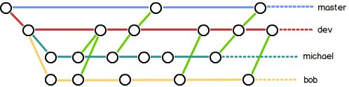

# Git | 一篇文章搞定Git、GitHub的理解和使用（学习笔记）

​																				2017年05月02日 

# Git learning note

本笔记整理自[廖雪峰老师的Git教程](https://www.liaoxuefeng.com/wiki/0013739516305929606dd18361248578c67b8067c8c017b000)，加上了自己的实践结果和一些理解，旨在使科研工作者（基本上是独立开发的那种）看完就能理解和使用Git。廖老师的教程生动活泼，条理清晰，推荐阅读。还可以赞助哦。

目录

- Git learning note
  - Git 简介
    - [Git 与 GitHub](https://blog.csdn.net/u014722627/article/details/71101904#git-与-github)
  - Git使用
    - [安装](https://blog.csdn.net/u014722627/article/details/71101904#安装)
    - [创建仓库](https://blog.csdn.net/u014722627/article/details/71101904#创建仓库)
    - [配置仓库](https://blog.csdn.net/u014722627/article/details/71101904#配置仓库)
    - [添加、提交：](https://blog.csdn.net/u014722627/article/details/71101904#添加提交)
    - [忽略某种文件](https://blog.csdn.net/u014722627/article/details/71101904#忽略某种文件)
    - [撤销修改](https://blog.csdn.net/u014722627/article/details/71101904#撤销修改)
    - [查看状态](https://blog.csdn.net/u014722627/article/details/71101904#查看状态)
    - [查看提交历史](https://blog.csdn.net/u014722627/article/details/71101904#查看提交历史)
    - [版本回退](https://blog.csdn.net/u014722627/article/details/71101904#版本回退)
    - [工作区、暂存区、版本库](https://blog.csdn.net/u014722627/article/details/71101904#工作区暂存区版本库)
  - GitHub使用
    - [通信设置](https://blog.csdn.net/u014722627/article/details/71101904#通信设置)
    - [从本地到远程：push](https://blog.csdn.net/u014722627/article/details/71101904#从本地到远程push)
    - [从远程到本地：clone & pull & fetch](https://blog.csdn.net/u014722627/article/details/71101904#从远程到本地clone-pull-fetch)
    - [参与开源项目](https://blog.csdn.net/u014722627/article/details/71101904#参与开源项目)
  - 分支
    - [为什么需要分支](https://blog.csdn.net/u014722627/article/details/71101904#为什么需要分支)
    - [分支的原则](https://blog.csdn.net/u014722627/article/details/71101904#分支的原则)
    - [创建、合并分支](https://blog.csdn.net/u014722627/article/details/71101904#创建合并分支)
    - [删除分支](https://blog.csdn.net/u014722627/article/details/71101904#删除分支)
    - [分支冲突](https://blog.csdn.net/u014722627/article/details/71101904#分支冲突)
    - [用图查看分支合并情况](https://blog.csdn.net/u014722627/article/details/71101904#用图查看分支合并情况)
    - [高级内容](https://blog.csdn.net/u014722627/article/details/71101904#高级内容)

## **Git 简介**

Git是分布式版本控制系统。 **啥是分布式，和与之相对的集中式**咧？

**举个栗子**

> 小a，小b，小c共同开发项目，有两种版本控制方法：

**集中式：**

> 服务器维护一个最新版本项目，当小a/b/c要修改项目的时候，就从服务器上下载项目，改完了上传。为了保证服务器上永远是最新的，就需要一直联网；而且一旦中央服务器崩了，一切都over。

CVS是最早的版本控制系统，SVN是目前最流行的集中式版本控制系统。上述两个都是开源、免费的。

**分布式**

> 一开始，小a本地电脑有一个仓库，用于储存“小a对项目的修改”（小b、小c也一样）。需要更新整个项目的时候，小a、b、c之间就互相推送“修改”，那么本地仓库就保存了“所有人对该项目的修改”。因此，每个人都有最新版的项目，断网断电也不用担心。

时下最火热的当然就是Git啦~ 

### Git 与 GitHub

项目伊始，只有一个原始版本库（版本库也叫仓库），别的机器可以clone这个原始版本库，那么所有clone的机器，它们的版本库其实都是一样的，并没有主次之分。

所以团队协作的时候，这样做到版本控制解：找一台电脑充当服务器的角色，oncall 24 hour，其他每个人都从这个“服务器”仓库clone一份到自己的电脑上，并且各自把各自的提交推送到服务器仓库里，也从服务器仓库中拉取别人的提交。(具体操作请看廖老师教程)

没有搭建服务器怎么办？用[GitHub](https://github.com/)。这个网站就是提供Git仓库托管服务的，所以，只要注册一个GitHub账号，就可以免费获得Git远程仓库。

GitHub还是一个开源协作社区，通过GitHub，既可以让别人参与你的开源项目，也可以参与别人的开源项目。

悄咪咪说一句，国内的Git托管服务是[码云](https://gitee.com/)

------

## **Git使用**

**命令简要解释**

| 命令                                           | 解释                                                |
| ---------------------------------------------- | --------------------------------------------------- |
| git init                                       | 初始化/新建仓库                                     |
| git config [–global]                           | 设置Git配置                                         |
| git add < filename >                           | 添加文件修改到暂存区                                |
| git commit                                     | 从暂存区提交本次修改到当前分支                      |
| git status                                     | 查看仓库状态（哪些文件修改、是否提交）              |
| git diff                                       | 查看和上一次commit版本的具体差别                    |
| git log                                        | 查看历史commit                                      |
| git log –graph                                 | 以图的形式查看当前分支历史commit                    |
| git reset                                      | 将当前版本退回设定版本                              |
| git checkout – < filename >                    | 撤销工作区文件的修改                                |
| git checkout < branchname >                    | 切换到指定分支                                      |
| git checkout -b < branchname >                 | 创建并切换到分支                                    |
| git rm < filename >                            | 从当前版本删除文件（相当于在文件系统删除文件后add） |
| git remote add < 远程仓库名 > < 远程仓库地址 > | 添加远程仓库                                        |
| git remote -v                                  | 查看所有远程仓库和地址                              |
| git push < 远程仓库名 > < 本地分支名 >         | 将本地分支推送到远程仓库                            |
| git clone < 远程仓库地址 >                     | 将远程仓库克隆到本地工作路径                        |
| git fetch < 远程仓库名 >                       | 抓取远程仓库所有更新到本地仓库                      |
| git pull < 远程仓库名 >                        | 抓取并合并远程仓库所有更新到本地仓库                |
| git branch                                     | 查看所有分支                                        |
| git branch < branchname >                      | 创建分支                                            |
| git branch -d < branchname >                   | 删除分支，将“-d”改为“-D”是强制删除                  |
| git branch -dr < remote/branch >               | 删除远程分支                                        |
| git merge < branchname >                       | 将指定分支合并到当前分支上                          |

### **安装**

在cmd输入`git`，看看系统有没有安装Git：

比如在linux下：

```
$ git
The program 'git' is currently not installed. You can install it by typing:
sudo apt-get install git123
```

### **创建仓库**

版本库又名仓库，英文repository，可以简单理解成一个目录，这个目录里面的所有文件都可以被Git管理起来，每个文件的修改、删除，Git都能跟踪，以便任何时刻都可以追踪历史，或者在将来某个时刻可以“还原”。

在你的工作目录下，输入

```
$ git init
Initialized empty Git repository in /Users/michael/learngit/.git/12
```

生成的 `.git` 目录就是用来跟踪管理仓库的。

### **配置仓库**

`git config`命令用于一系列配置。配置Git的时候，加上`--global`是针对当前用户起作用的（比如给命令起别名），如果不加，那只针对当前的仓库起作用。

**配置文件：** 
每个仓库的Git配置文件都放在.git/config文件中，当前用户的Git配置文件放在用户主目录下的一个隐藏文件.gitconfig中。

### **添加、提交：**

用命令`git add <filename>` 将文件更改添加到暂存区，`git add .`添加所有更改到暂存区

```
$ git add readme.txt
$ git add .12
```

添加成功则没有返回消息

```
$ git commit -m "wrote a readme file"
[master (root-commit) cb926e7] wrote a readme file
 1 file changed, 2 insertions(+)
 create mode 100644 readme.txt1234
```

参数`-m` 后面是这次提交的说明

### **忽略某种文件**

工作目录下创建一个名为.gitignore的文件，把要忽略的文件名或文件夹或文件类型填进去，Git就会在commit的时候自动忽略这些文件。

不需要从头写.gitignore文件，GitHub已经为我们准备了各种配置文件，只需要组合一下就可以使用了。所有配置文件可以直接在线浏览：[github/gitignore](https://github.com/github/gitignore)

忽略文件的原则是：

- 忽略操作系统自动生成的文件，比如缩略图等；
- 忽略数据集；
- 忽略编译生成的中间文件、可执行文件等，也就是如果一个文件是通过另一个文件自动生成的，那自动生成的文件就没必要放进版本库，比如Java编译产生的.class文件；
- 忽略你自己的带有敏感信息的配置文件，比如存放口令的配置文件。

**举个栗子**

> 一个.gitignore文件

```
# Windows:
Thumbs.db
ehthumbs.db
Desktop.ini

# Python:
*.py[cod]
*.so
*.egg
*.egg-info
dist
build

# My configurations:
db.ini
deploy_key_rsa
1234567891011121314151617
```

更多实操请看廖老师教程。

### **撤销修改**

一般步骤是 **commit_last->）add_1->(add_2->…add_n)->commit**，你可能会在这些时间点希望撤销：

1. 修改还没add到暂存区，希望**撤销工作区的修改**，则撤销结果是撤销回上一次commit或上一次add，取决于add_1否是已经发生过

   命令`git checkout -- <filename>`可以丢弃工作区的修改：

   ```
   $ git checkout -- readme.txt1
   ```

   `--`这个参数说明是针对当前分支的文件，如果只用 `git checkout  <branch_name>`表示的是切换分支

2. 修改已经add_i，想撤销到add_j

   不行，已经add过之后，工作区没东西可以撤销。暂存区里面没有“版本回退”。

总之，**只能**使用`git checkout`**撤销工作区的修改**。版本回退只能用`git reset`在commit过的版本库里面回退。

“删除文件”也是一种修改操作，commit过的文件一直存在版本库里，所以在工作区删除文件（如testdel.txt）也可以撤销。此时用`git checkout -- <deletedfilename>`可撤销还没有add的“删除操作”

**举个栗子** ：(|)表示当前

```
$ git status
On branch master
Changes to be committed:
  (use "git reset HEAD <file>..." to unstage)

        modified:   git node.md
        new file:   testdel.txt

Changes not staged for commit:
  (use "git add/rm <file>..." to update what will be committed)
  (use "git checkout -- <file>..." to discard changes in working directory)

        deleted:    testdel.txt12345678910111213
```

(文件没有commit过) add->删除文件->add(|)->commit 的status：工作区修改为空不可撤销

```
$ git status
On branch master
Changes to be committed:
  (use "git reset HEAD <file>..." to unstage)

        modified:   git node.md123456
```

commit->删除文件->add(|)->commit 的status：工作区修改为空不可撤销，需要版本回退

```
$ git status
On branch master
Changes to be committed:
  (use "git reset HEAD <file>..." to unstage)

        deleted:    testdel.txt

$ git checkout -- testdel.txt
error: pathspec 'testdel.txt' did not match any file(s) known to git.123456789
```

前面说到，commit过的文件一直存在版本库里，如果确定已经不需要该文件了，可以直接`git rm <filename>` （经实践，亲测相当于删除后add）

### **查看状态**

在工作目录下使用命令`git status`查看当前仓库状态，包括更新了哪些文件，有没有add，有没有commit：

```
 $ git status
On branch master
Changes not staged for commit:
  (use "git add <file>..." to update what will be committed)
  (use "git checkout -- <file>..." to discard changes in working directory)

        modified:   test.py

Untracked files:
  (use "git add <file>..." to include in what will be committed)

        git node.md

no changes added to commit (use "git add" and/or "git commit -a")1234567891011121314
```

当前对比上一次commit具体做了什么更改，可用`git diff`命令查看，该命令显示格式是Unix通用的diff格式。

```
$ git diff1
```

查看当前工作区的文件与当前分支最新版本的区别：

```
$ git diff HEAD -- <filename>1
```

### **查看提交历史**

查看历史commit，用`git log`，显示顺序是由最近到最久远

```
$ git log
commit e950b67202ee0060faca06f963bfa97550ca90de
Author: unknown <411037167@qq.com>
Date:   Wed Aug 9 23:59:14 2017 +0800

    add git node

commit f8d90c0d112489303e919915d15519da9fdeb5bc
Author: unknown <411037167@qq.com>
Date:   Wed Aug 9 22:27:39 2017 +0800

    update readme.txt

commit ed4ce2f7ef016e99182dcaf75f9335d70f53ec1b1234567891011121314
```

用`git log --pretty=oneline`得到一个更加简洁的一行显示方式：

```
$ git log --pretty=oneline
e950b67202ee0060faca06f963bfa97550ca90de add git node
f8d90c0d112489303e919915d15519da9fdeb5bc update readme.txt
ed4ce2f7ef016e99182dcaf75f9335d70f53ec1b add readme.txt1234
```

这一长串 commit id，是一个大数字经过SHA1编码的十六进制表示。在引用的时候可以省略地只打前几个字符，只要系统能区别就行。

### **版本回退**

把当前版本回退到上一个版本，就可以使用`git reset`命令：

```
$ git reset --hard HEAD^
HEAD is now at ea34578 add distributed12
```

返回指定commit id（可简写）的版本：

```
$ git reset --hard 3628164
HEAD is now at 3628164 append GPL12
```

- HEAD：

   实际是一个指针，作用是

  指向版本库中当前分支的当前版本

  ​

  - HEAD^ :上一个版本
  - HEAD^^ :上上一个版本
  - HEAD~100 ：往上100个版本

当回退版本的时候，**Git仅仅是把HEAD改为指向你指定回退的版本，然后顺便把工作区的文件更新了**。（所以回退ok，前进也ok，毕竟只是把指针换个地方指，就意味着“当前版本是这个啦”）

用`git reflog`命令查看每一次git 操作，从而可以查看commit id：

```
$ git reflog
ea34578 HEAD@{0}: reset: moving to HEAD^
3628164 HEAD@{1}: commit: add source code
ea34578 HEAD@{2}: commit: update readme
cb926e7 HEAD@{3}: commit (initial): add readme12345
```

这个例子表示即使从“add source”回退了上一个版本“update readme”（第一行），还是可以查看“update readme”的commit id（第二行显示内容）

### **工作区、暂存区、版本库**

关于工作区（working directory）、暂存区（storage）、版本库（repository）的概念，请看[廖雪峰教程配图和讲解](https://www.liaoxuefeng.com/wiki/0013739516305929606dd18361248578c67b8067c8c017b000/0013745374151782eb658c5a5ca454eaa451661275886c6000)。

一般步骤是 **commit_last->）add_1->(add_2->…add_n)->commit**，每次add都更新暂存区，每次commit都更新版本库。

- **版本库**可以回退版本、切换分支
- 还没暂存的**工作区**操作可以被撤销
- **暂存区**的add_i，add_(i+1),…,add_n之间不可以回退。

------

## **GitHub使用**

Github上的东西是公开的，如果不想给人看，要交“保护费”的。想要**私有**的另一个方法是：**自己搭建一台服务器作为Git仓库——适用于企业内部开发。** 接下来主要还是GitHub的相关使用。

### **通信设置**

Git使用SSH连接，使用GitHub，你需要做如下设置：

1. 注册GitHub账号：用邮箱就能注册。
2. 设置本地Git与GitHub通信的SSH协议: 
   在用户目录的.ssh目录存放公钥和私钥： 
   [ Windows 7下Git SSH 创建Key的步骤（by 星空武哥）](http://blog.csdn.net/lsyz0021/article/details/52064829)
3. 在GitHub添加公钥: 
   登陆GitHub网站。点击个人头像处下拉菜单view profile and more。左边personnal settings一栏点击“SSH and GPG keys”。点击添加公钥。

第2-3步对你要用到的每台机器都可以设置 
SSH连接在第一次验证GitHub服务器的Key时（如第一次clone或push），会发出SSH警告，需要你确认GitHub的Key的指纹信息是否真的来自GitHub的服务器，敲yes就好。

### **从本地到远程：push**

把本地的仓库推送到GitHub的仓库：

1. 在GitHub网站上创建仓库： 
   点击头像旁边的+号，new repository是创建新仓库，import reposi是从其他版本控制系统导入文件和历史记录。这里我创建了一个名叫“nonblindGAN”的项目。

2. 从本地仓库关联远程库GitHub，使用命令： 
   `git remote add <remote_name> git@server-name:path/repo-name.git`

3. 推送内容到GitHub的仓库： 
   如果用`git push <remote_name> <branch_name>`命令，把当前分支`master`推送到名为`origin`的远程仓库，则具体步骤为：

   - 第一次推送master分支的所有内容，使用命令：

     ```
     $ git push -u origin master1
     ```

   - 之后每次本地commit后，如需推送master最新修改，使用命令：

     ```
     $ git push origin master1
     ```

   如需推送当前分支最新修改，使用命令：

   ```
   $ git push1
   ```

   参数`-u`：如果当前分支与多个主机存在追踪关系，则可以使用-u选项指定一个默认主机，这样后面就可以不加任何参数使用git push。

**举个栗子**

> 我在账号chudanwu下创建了一个仓库“nonblindGAN”，创建完后打算按照提示：*‘push an existing repository from the command line* 干活。

第一行是通过https协议连接远程仓库，第二行是通过SSH协议。使用https除了速度慢以外，还有个最大的麻烦是每次推送都必须输入口令，但是在某些只开放http端口的公司内部就无法使用ssh协议而只能用https。

```
$ git remote add origin https://github.com/chudanwu/nonblindGAN.git
$ git remote add origin git@github.com:chudanwu/nonblindGAN.git
$ git push -u origin master123
```

**远程库的名字就是origin，这是Git默认的叫法**（比如clone的时候会自动命名，后面会提到），可以用别的，但是origin这个名字一看就知道是远程库。

### **从远程到本地：clone & pull & fetch**

**clone**

假设**本地没有仓库**，**GitHub远程端有个仓库**，那么我们要开发，就把GitHub上的仓库clone下来（将会创建一个文件夹）。此时使用命令： 
`git clone <remote_address>` 
clone的同时会自动命名remote为`origin`，想要自己设定的话，给clone命令加上参数`-o`:  
`git clone -o <remote_name> <remote_address>`

同样`remote_address`可以是https的，或者ssh，GitHub还支持其他协议，但通过ssh支持的原生git协议速度最快。

- 通过SSH clone：

  ```
  $ git clone git@github.com:chudanwu/nonblindGAN.git
  12
  ```

- 通过https clone：

  ```
  $ git clone https://github.com/chudanwu/nonblindGAN.git
  12
  ```

**【本小节后面的内容涉及“分支”的概念，建议先行跳过，看完第三部分“分支”再倒回来】**


**fetch**

如果本地已经创建了仓库，比如已经`init`和`remote add` ，现在需要把仓库里存在的内容抓取过来。此时可以在工作区（工作目录）使用命令 
`git fetch <remote_name>` 
或者 
`git fetch <remote_name> <remote_branch>`。

`git fetch`作用是将某个远程库的所有分支或指定分支，全部取回本地。命令通常用来查看其他人的进程，因为它取回的代码对你本地的开发代码没有影响。

**抓取不会改变工作区**，而是暂时保存了 remote仓库所有分支到本地，命名为`remote_name/remote_branch`，如果要更新工作区，还需要merge一下，即： 
`git merge remote_name/remote_branch`

**举个栗子**

> 在本地的新仓库处（只做了`init`和`remote add`），把叫做`github`的远程库的分支全部抓取下来：

```
PS C:\Users\**\blindGAN> git fetch github
remote: Counting objects: 29, done.
remote: Compressing objects: 100% (23/23), done.
remote: Total 29 (delta 4), reused 29 (delta 4), pack-reused 0
Unpacking objects: 100% (29/29), done.
From github.com:chudanwu/blindGAN
 * [new branch]      dev        -> github/dev
 * [new branch]      master     -> github/master
PS C:\Users\**\blindGAN> git branch
#无显示，没有branch
PS C:\Users\**\blindGAN> git checkout dev
Branch dev set up to track remote branch dev from github.#建立了追踪关系
Switched to a new branch 'dev'
PS C:\Users\**\blindGAN> git checkout master
Branch master set up to track remote branch master from github.#建立了追踪关系
Switched to a new branch 'master'  #checkout后，都自动在本地库建上相应的branch
PS C:\Users\**\blindGAN> git checkout dev
Switched to branch 'dev'
Your branch is up-to-date with 'github/dev'.  #再次切换告诉你是最新的
PS C:\Users\**\blindGAN> git branch  #现在查看branch有好几个了
* dev
  master
PS C:\Users\**\blindGAN> git branch -a 
#显示所有branch，后面两个是fetch来的
* dev
  master
  remotes/github/dev
  remotes/github/master

123456789101112131415161718192021222324252627282930
```

如果抓取过来的分支/所有分支，不需要merge，（比如抓取dev分支，在dev上再做分支自己开发新功能用），可使用命令 
`git checkout -b <newbranch> <remote_name/remote_branch>`，即

```
$ git checkout -b newfun1 origin/dev1
```

**pull**

- `git pull <remote_name> <remote_branch>:<local_branch>`:抓取远程库某个分支的更新，再与本地的指定分支合并。
- `git pull <remote_name> <remote_branch>`:抓取远程库某个分支的更新，再与本地当前分支合并。
- `git pull <remote_name>`:本地的当前分支自动与存在追踪关系的远程库分支”进行合并。

下面两个操作是一个意思：

```
$ git pull remote_name remote_branch1
```

```
$ git fetch remote_name
$ git merge remote_name/remote_branch12
```

都是取回remote_name/remote_branch分支，再与当前分支合并。

在一些场合，Git会自动建立**追踪（tracking）关系**，比如上面fetch的例子，再比如clone的时候。建立追踪关系的原则是“分支名相同的自动建立”。 
Git也允许手动建立追踪关系： 
`git branch --set-upstream <local_branch> <remote_name/remote_branch>` 

如果当前分支与远程分支存在追踪关系，pull就可以省略远程分支名，写为 
`git pull <remote_name>` 
作用是：本地的当前分支自动与对应的远程库的”追踪分支”（remote-tracking branch）进行合并。

**push**

和pull：`git pull <remote_name> <remote_branch>:<local_branch>`类似，有push。 
前面提到过的push，实际上写法应该是 
`git push <remote_name> <local_branch>:<remote_branch>` 
表示将本地指定分支推送到远程库指定分支。 
如果省略`:<remote_branch>`，则自动在远程库创建新分支； 
如果省略`<local_branch>`（写为`git push <remote_name> :<remote_branch>`，则自动删除远程库的分支（因为push了空分支））

但通常，实际上大家都会将本地分支和远程分支命名成一样的，所以由于追踪关系的存在，pull 和 push可以分别简写成

- pull：`git pull <remote_name>`
- push：`git push <remote_name>`

[**多人协作情景演练**：查看教程例子来理解](https://www.liaoxuefeng.com/wiki/0013739516305929606dd18361248578c67b8067c8c017b000/0013760174128707b935b0be6fc4fc6ace66c4f15618f8d000)

### **参与开源项目**

在GitHub上，可以任意Fork开源仓库；自己拥有Fork后的仓库的读写权限；可以推送pull request给官方仓库来贡献代码。

具体来说步骤如下：

1. 对开源项目，从官方fork到自己的仓库
2. 对fork到仓库的项目，clone 到本地（一定要从自己的账号下clone仓库，这样你才能推送修改。如果从官方仓库地址clone，因为没有权限，你将不能推送修改。）
3. 修改完项目后，往自己的仓库push。
4. 如果你希望官方仓库能接受你的修改，可以在GitHub上发起一个pull request。当然，对方是否接受你的pull request就不一定了。

------

## **分支**

无论创建、切换和删除分支，Git在1秒钟之内就能完成！无论你的版本库是1个文件还是1万个文件。

### **为什么需要分支**

用分支的目的是什么？或者说，使用的情景是怎样的？

**举个栗子**：

> 你准备开发一个新功能，需要两周才能完成，第一周你写了50%的代码，如果立刻提交，由于代码还没写完，不完整的代码库会导致别人不能干活了。如果等代码全部写完再一次提交，又存在丢失每天进度的巨大风险。
>
> 现在有了分支，就不用怕了。你创建了一个属于你自己的分支，别人看不到，还继续在原来的分支上正常工作，而你在自己的分支上干活，想提交就提交，直到开发完毕后，再一次性合并到原来的分支上，这样，既安全，又不影响别人工作。

### **分支的原则**

在实际开发中，我们应该按照几个基本原则进行分支管理：

- master分支应该是非常稳定的，仅用来发布新版本，平时不能在上面干活。
- 干活都在dev分支上，也就是说，dev分支是不稳定的，到某个时候，比如1.0版本发布时，再把dev分支合并到master上，在master分支发布1.0版本。
- 你和你的小伙伴们每个人都在dev分支上干活，每个人都有自己的分支，时不时地往dev分支上合并就可以了。 
  

在企业级开发中，工作流程图可参考以下文章

- [Git版本控制与工作流](http://www.jianshu.com/p/67afe711c731)
- [Git工作流指南：Gitflow工作流](http://www.uml.org.cn/pzgl/201410271.asp)

都有很多插图，棒棒哒。

### **创建、合并分支**

第一条分支是主分支master。你可以把它想象成一个时间串儿，每commit一次，就给这条串儿添加一个节点——串就变长一点。 
HEAD指向你最新commit的那个结点。实际上是**HEAD指向当前分支名**，当前分支名指向最新commit，所以HEAD指向当前分支的commit。 
我们按照例子中的步骤来看（其实是很实际的例子），有以下几步：

1. 现有主分支master
2. 创建分支dev
3. 在分支dev上做开发，正常的commit
4. 开发完成，合并分支dev和master
5. 删除分支dev

> 一开始的时候，master分支是一条线，Git用master指向最新的提交，再用HEAD指向master，就能确定当前分支，以及当前分支的提交点。创建新的分支dev时，Git新建了一个指针叫dev，指向master相同的commit，再把HEAD指向dev，就表示当前分支在dev上。

```
1=>2
                                          dev ← HEAD
                  创建分支dev              ↓
--o--o--o--o--o       ==>    --o--o--o--o--o
              ↑                           ↑
           master ← HEAD                master         
1234567
```

> 从现在开始，对工作区的修改和提交就是针对dev分支了，比如新提交一次后，dev指针往前移动一步，而master指针不变

```
3
               dev ← HEAD               HEAD → dev
                ↓                              ↓
                o                            o--o
               /   再次commit               /
--o--o--o--o--o       ==>    --o--o--o--o--o
              ↑                           ↑
           master                       master         
123456789
```

> 在dev上的工作完成了，就可以把dev合并到master上。在我们的例子中，直接把master指向dev的当前提交，就完成了合并。删除dev分支就是把dev指针给删掉，删掉后，我们就剩下了一条master分支

```
4=>5
                  dev  
                   ↓    删除dev                   
                o--o      ==>            HEAD → master
               /   ↑                             ↓
--o--o--o--o--o   master      --o--o--o--o--o--o--o   
                   ↑
                 HEAD
123456789
```

接下来看看实际上命令怎么敲：

**创建分支并切换到分支**

```
$ git checkout -b dev
Switched to a new branch 'dev'12
```

`git checkout`命令加上`-b`参数表示创建并切换，相当于

```
$ git branch dev
$ git checkout dev
Switched to branch 'dev'123
```

平时切换分支的时候，注意**在切换前把add到暂存区的修改commit掉**，因为分支是共享暂存区的，一不小心就会有产生”误会”

**查看现有分支**

命令`git branch <branch_name>`可查看现有分支，有“*”号的分支是当前所在分支

```
$ git branch
* dev
master123
```

**合并分支**

前情提要：在分支上dev修改`readme.txt`，然后commit。

```
$ git merge dev
Updating d17efd8..fec145a
Fast-forward
 readme.txt |    1 +
 1 file changed, 1 insertion(+)12345
```

输出`Fast-forward`：说明这次合并是“快进模式”，也就是直接把master指向dev的当前提交，所以合并速度非常快。当然，也不是每次合并都能Fast-forward。

合并分支时，如果可能，Git会用Fast forward模式（如例子里的4=>5），但这种模式下，删除分支后，会丢掉分支信息。

如果要强制禁用Fast forward模式，Git就会在merge时生成一个新的commit，这样，从分支历史上就可以看出分支信息。禁用的情况下merge命令是：`git merge --no-ff -m "commit description" branchname`。 
因为本次合并要创建一个新的commit，所以加上`-m`参数，把commit描述写进去。

```
$ git merge --no-ff -m "merge with no-ff" dev
Merge made by the 'recursive' strategy.
 readme.txt |    1 +
 1 file changed, 1 insertion(+)1234
```

```
fast-forward
               dev                      
                ↓                               
                o                            dev
               /   merge dev                 ↓ 
--o--o--o--o--o       ==>    --o--o--o--o--o--o   
              ↑                              ↑  
           master ← HEAD                   master ← HEAD 


no-ff
               dev                          dev
                ↓                           ↓
                o                            o
               /   merge dev                / \
--o--o--o--o--o       ==>    --o--o--o--o--o---o
              ↑                               ↑
           master ← HEAD             HEAD → master                  
12345678910111213141516171819
```

### **删除分支**

合并完成后，就可以放心地删除dev分支了。当然，**当前分支是不能删除的，请先切换。**

```
$ git branch -d dev
Deleted branch dev (was fec145a).12
```

### **分支冲突**

不是所有的merge都可以成功，当两个分支都commit了，如果互相有冲突（同一个地方有改动，不管内容是否一样，都有冲突），是merge不了的。需要查看冲突部分，手动修改后，才能merge。

**举个栗子**：

我们在分支master和分支test中分别修改 `readme.txt`并commit，那么这时如果merge，就会在`readme.txt`上产生冲突。

```
               test  
                ↓    
                o  
               /      
--o--o--o--o--o--o             
                 ↑
               master ← HEAD
12345678
```

```
$ git merge test
Auto-merging readme.txt
CONFLICT (content): Merge conflict in readme.txt
Automatic merge failed; fix conflicts and then commit the result.1234
```

上面这段输出说明自动merge失败了。要你解决冲突。 
而在`readme.txt`中，Git用<<<<<<<，=======，>>>>>>>标记出不同分支的冲突部分内容。

用`git status`命令查看冲突的文件：

```
$ git status
On branch master
Your branch is ahead of 'origin/master' by 2 commits.
  (use "git push" to publish your local commits)
You have unmerged paths.
  (fix conflicts and run "git commit")
  (use "git merge --abort" to abort the merge)

Unmerged paths:
  (use "git add <file>..." to mark resolution)

        both modified:   readme.txt

no changes added to commit (use "git add" and/or "git commit -a")1234567891011121314
```

前面是说本地版本比远程版本多commit了两次，后面是说明冲突的文件和解决方法：`readme.txt`文件存在冲突，必须手动解决冲突后再提交。也就是说**mergeing被中断了**，等你改掉`readme.txt`中的冲突段然后**commit的时候，将会完成merge**。 

改完之后（比如直接把冲突段都留下来，各留一行），add，然后看status：

```
$ git status
On branch master
Your branch is ahead of 'origin/master' by 2 commits.
  (use "git push" to publish your local commits)
All conflicts fixed but you are still merging.
  (use "git commit" to conclude merge)

Changes to be committed:

        modified:   readme.txt12345678910
```

还剩下commit就完事了！commit后就完成merge了。

### **用图查看分支合并情况**

用`git log --graph`命令可以看到分支合并图。

简化版：`git log --graph --pretty=oneline --abbrev-commit`

这个命令好像很长的样子，没关系，可以给他设置别名：

```
$ git config --global alias.lg "log --color --graph --pretty=format:'%Cred%h%Creset -%C(yellow)%d%Creset %s %Cgreen(%cr) %C(bold blue)<%an>%Creset' --abbrev-commit"1
```

一个华丽丽的效果，靠`git lg`就能输出来。

当前分支的是直线，merge 过来的分支是折线。fast-forward的合并看不到折线（只要直线），禁用fast-forward后可以看到。

**举个栗子**

```
#改动readme，解决冲突后，test合并到master
#当前分支为master
$ git log --graph --pretty=oneline --abbrev-commit
* 3f619af master readme2
*   0e15a96 conflict fixed
|\
| * d99660c test readme
* | 8a5a09a master readme
|/
* 75692c8 branch test
...
#上面完事后，再次修改两个分支的readme，解决冲突后，master合并到test
#当前分支为test
$ git log --graph --pretty=oneline --abbrev-commit
*   f0d6e01 master merge to test1
|\
| * 3f619af master readme2
| *   0e15a96 conflict fixed
| |\
| * | 8a5a09a master readme
* | | bf852ab test readme2
| |/
|/|
* | d99660c test readme
|/
* 75692c8 branch test
...
12345678910111213141516171819202122232425262728
```

### **高级内容**

包括对bug开一个分支如何操作，对实验性新功能（feature）开一个分支如何操作，多人合作啥时候远程推送等，暂时用不到的技能，请参看[廖老师的教程](https://www.liaoxuefeng.com/wiki/0013739516305929606dd18361248578c67b8067c8c017b000/0013760174128707b935b0be6fc4fc6ace66c4f15618f8d000)。