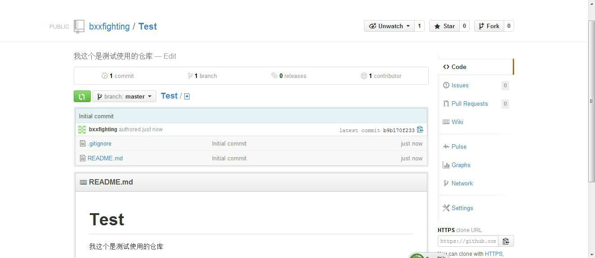
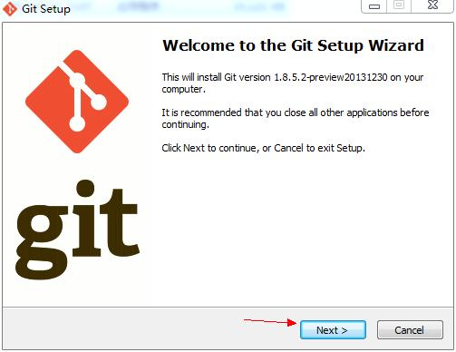
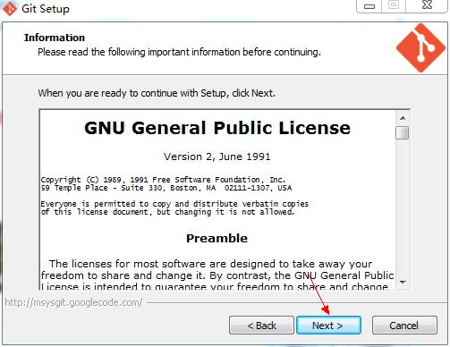
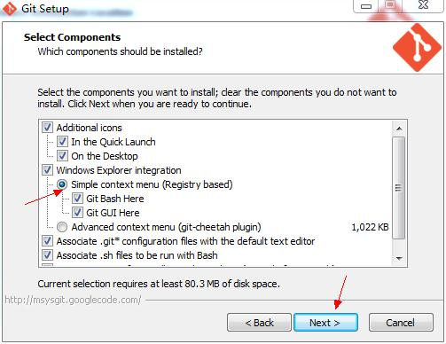
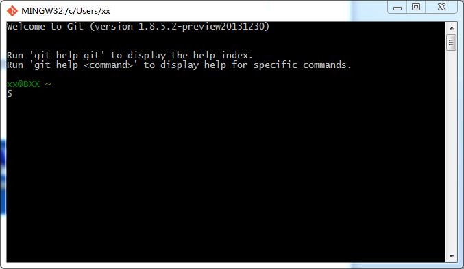
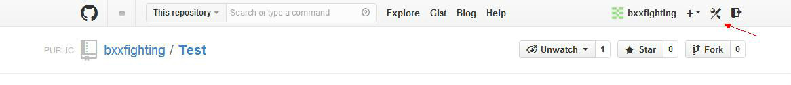
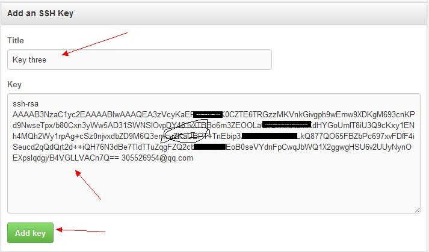
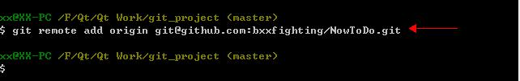

# 			[简单使用Git和Github来管理自己的代码和读书笔记](https://www.cnblogs.com/ldq2016/p/5468987.html)		

以前不知道使用代码管理工具，最后写的一些东西都没有了，由于硬盘坏了或者不小心格式化了之类的，后来使用了Git

和Github来托管自己的代码和读书笔记方便了不少，到哪里只要有网就可以把自己的东西拷贝下来继续使用。

我这里简单的记录一下我使用的过程，最简单的使用都是，高级的功能我一直没有使用到，虽然买一本《Git权威指南》

但是很多东西用不到就不能够真的会。下面开始简单介绍我使用的方法，我这个是在windows上使用的。我使用分两种情况，

因为我的代码都是在Linux下写的，所以在linux下主要是托管代码用，在windows下主要是托管笔记使用的，比如一些PDF

文档，我在看的时候会加入自己的注释，这样使用托管功能，在哪里都可以接着注释，不用总是拷贝或者总是需要复制。

1. 先注册github.com的账号官方网站: <https://github.com/> 

注册界面，第一个用户名，以后会用到，我的是bxxfighting 

 

2.      登录界面 

 

3.      登录成功后界面 

 

4.      创建仓库,我现在想使用github来托管自己的NowToDo项目的代码,因此先要创建一个仓库,仓库分公开的和私有的,公开的是免费的,私有的是收费的,我使用的是公开的仓库,如下创建方式 

 

点击New repository按钮,弹出如下界面,第一行填仓库名,这里就随便叫Test了,第二行是对这个仓库的描述,之后那个Public就是公共仓库的意思,接下来的README就是在仓库里创建一个README文件,可以往里写一些介绍你这个项目的功能之类的东西,再下面那个Add gitignore按钮,可以选择你这个项目是用什么语言之类的,我这里选择了Qt,后面那个License我没有选,点击”Create repository” 

 

5.      创建仓库成功后,界面如下显示,可以点击README.md来编译这个文件 

 

 

# 在windows下安装Git 

1.      下载网址: http://code.google.com/p/msysgit/downloads/list 

2.      下载完毕,打开安装,点击”next” 

 

3.      点击”next” 

 

4.      可以更改安装路径后,点击”next” 

 

5.      按照默认的就可以,我这里更改了一处,可以不改，这个最好还是用默认配置好，不要改了，我第二次装就没有改这里，要不然可以有不一致的地方，推荐不要改了，使用默认 

 

6.      直接点”next” 

 

7.      默认设置就可以 

 

8.      默认设置就可以，如果你的机器装了SVN的话，这里可能还会有一步，就是让你选择SSH的，也不要更改，就直接默认就好，也就是说安装这个软件的时候，其实只有安装路径想改的话，更改一下就好了，其它的都保持默认就OK了 

 

9.      点击”next” 

 

# 使用git和github托管项目代码 

1.      双击图标”Git Bash” 

 

2.      打开界面如下 

 

3.      配置Git,图示如下: 

a)       

1

输入

 

`      $ ssh``-``keygen ``-``t rsa ``-``C ``"abcd@efgh.com"` `/``/``邮箱同上`

 

b)        回车之后,会出现一行,让你输入一个保存密钥的地方,括号里面是它默认的位置,可以在冒号后面自己写一个位置保存,我这个是在E盘下创建了一个目录叫Hello,后面那个id_rsa就是密钥要保存的文件名,这个文件是自动生成的,后生成两个一个叫id_rsa,一个叫id_rsa.pub，我这么做了之后，发现生成的密钥目录里少了一个文件known_hosts，如果按照默认的目录的话是有这个文件的，如果没有这个文件，后序出现了问题，因此，建议还是直接用他的默认路径就好，这里就不要自己填路径了，直接回车 

c)        回车之后,会设置密码,我这里没有设置,直接点了回车两次,这样密钥就生成了,可以打开id_rsa.pub来查看,我使用的是记事本直接打开的这个文件,里面的所有内容就是这个密钥,一会需要使用的时候,就直接全选复制就可以了 

 

 

 

 

d)        现在转到github网站上去配置一下ssh key,点击箭头指示图标Account settings，然后点击左侧的SSH Keys，之后点击右侧的Add SSH Key，这样就会出现添加SSH Key的界面，在Title这一栏填一个名字，名字随意起，之后打开刚才生成的那个文件id_rsa.pub，全选复制里面的内容到Key这一栏中，点击Add Key按钮完成操作，这时你填的邮箱会收到一封确认的邮件，不用管它 

 

 

 

e)        验证一下是否设置成功,在git bash下输入如下命令： 

ssh –T git@github.com 

出现如下图示，因为我不是第一次设置了，所以是这样的，如果你是第一次，会让你输入yes或no,这时输入yes就可以了，其它显示就和我这个是一样的。如果你的是出现不是这些内容，有可能是显示权限问题什么的，就应该是我上面提到的那种情况，你看一下你生成密钥时是否操作正确，目录下是否有那个known_hosts这个文件 

 

f)        现在配置一下用户名和邮箱： 

git config –global user.name “用户名” 

git config –global user.email “邮箱” 

 

4.      到现在为止，我们就算把Git和github配置完了，我现在要做的事情是把自己的QT项目NowToDo托管到github上，那么就开始操作吧 

a)        随意创建了一个目录叫git_project 

 

b)        右击目录，出现的菜单中有Git Init Here，点击它，这时在这个目录下会出现一个隐藏目录.git，这个是有关配置等功能的，不用管，我的项目NowToDo在这个NowToDo目录下，包括.cpp等文件 

 

 

c)        现在回到git_project那里，在这个目录上继续右击，点击Git Bash，现在就出现一个和开始使用那个Git Bash一样的窗口，不过现在是在git_project目录下使用了，其实如果知道Shell命令，可以直接使用刚才的那个窗口直接使用cd命令进入这个目录下，效果是一样的，现在输入如下命令： 

git remote add origin [git@github.com:bxxfighting/NowToDo.git](mailto:git@github.com:bxxfighting/NowToDo.git) 

其中bxxfighting是我在网站上注册时使用的用户名，NowToDo.git是我为这个项目建立的另一个仓库名，在网站上显示是这样的 

 

 

 

d)        由于我建立仓库的时候创建README.md之时，已经算一次提交了，我需要先在本地同步一下仓库的内容,命令如下： 

git pull [git@github.com:bxxfighting/NowToDo.git](mailto:git@github.com:bxxfighting/NowToDo.git) 

完成的效果如下图，并且本地目录下多出了两个文件，这是原本在github上的两个文件 

 

 

e)        下面就要把我们本地的上传到仓库上去了，首先执行增加命令，如下： 

git add . 

add后面加了一个点，是想要提交所有文件，如果想提交指定的文件，可以写文件名，执行完增加命令后，要执行提交命令，如下： 

git commit –m “NowToDo_v1.0版本” 

-m后面跟提示信息，这个提示信息是一定要写的，不仅是规则，同时也方便我们记录我们提交的过程，写清晰为什么提交或修改了什么是非常有用的，提交完成后，我们就要把它推送到远程仓库上去了，命令如下： 

git push [git@github.com:bxxfighting/NowToDo.git](mailto:git@github.com:bxxfighting/NowToDo.git) 

这样就完成了我们要做的所有任务 

 

 

 

 

到这就差不多了，我每次用其实都来看看，不是总是用，有点记不住，第一次这样就过就记下了，方便以后使用。其实 

这真是非常方便的，可以使用熟练，管理自己的代码和笔记很好的东西，以前管理代码，最近发现每次看电子书，里面写上笔记，但是同步费劲，现在决定用它来管理了，回去在自己的笔记本上也这样来用，就可以同步自己看的进度了。
来自：http://my.oschina.net/bxxfighting/blog/378196 