# Linux开机启动

详解： http://blog.chinaunix.net/uid-23036581-id-2230525.html  

## 一、简单介绍RHEL

开机时的先后顺序BIOS —> MBR —> Kernel —> init

1、当电脑一打开电源时电脑就会进入BIOS（BIOS的工作主要是检测一些硬件设备）；
2、检测完后会进入MBR也就是boot loader（MBR位于硬盘的第一个扇区总共512bytes，其中前446bytes里面的编码是在选择引导分区也就是决定要由哪个分区来引导）；
3、载入系统的Kernel(核心)，在Kernel里主要是载入电脑设备的驱动程序，以便可以控制电脑上的设备，并且以只读方式来挂载根目录，也就是一开始只能读取到根目录所对应的那个分区，所以/etc、/bin、/sbin、/dev、/lib这五个目录必须同根目录在一个分区中；
4、最后启动init这个程序，所以init这个程序的进程编号为1，是Linux中第一个执行的程序；
init这个程序会根据 Run level来执行以下这些程序：
·/etc/rc.d/rc.sysinit;
·/etc/rc.d/rc 和 etc/rc.d/rc?.d/
·/etc/rc.d/rc.local
·如果有适当的图形界面管理程序

## 二、BIOS初始化时主要的三个任务

BIOS**（**B**asic **I**nput/**O**utput **System）

1、电脑周边设备的检测，加电自检 **POST** （Power on self test）；
2、BIOS会选择要由哪一个设备来开机，例如：软盘启动、光盘启动、网络启动、最常见的从硬盘启动；
3、选择好由哪个设备开机后，就开始读取这个设备的 MBR 引导扇区；

## 三、介绍Boot Loader中的主要工作

1、Boot Loader可以安装在两个地方：

· 安装在硬盘的MBR中；
· 当有时候MBR中被其他开机管理程序占用就可以将 Boot Loader 安装在硬盘中的其中一个分区的引导扇区上，；
2、Boot Loader的程序码分为两个阶段：
   (1)Boot Loader第一阶段的程序码非常小，只有446bytes，可以存入在MBR或是某一个分区的引导扇区里，
   (2)Boot Loader第一阶段的程序码是从 boot 分区来载入的，就是说 Boot Loader 第二阶段程序码存放在 /boot 这个分区中； 
3、下面来看三个Boot Loader 的开机流程范例，如在一块硬盘中安装了两个系统分别为：windows 2003 和 Red hat linux
当电脑开机后，会先载入MBR通过第一阶段程序码来载入第二阶段程序码，进入GRUB开机菜单这里选择哪个系统就会载入相应的核心；
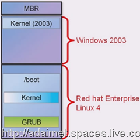 

## 四、介绍GRUB和grub.conf 这个配置文件的内容

其实从MBR载入Boot Loader开始，载入Kernel，载入init这些程序之间都是由GRUB这个多重开机管理程序所负责的。
1、GRUB （**GR**and **U**nified **B**ootloader）拥有以下特性：
· GRUB的开机管理程序可以在开机提示字元的界面下输入指令；例如在GRUB界面下可以按C键就会来到以 grub> 开头的提示符来输入据指令；
· GRUB的开机管理程序可以支持以下几种文件系统：ext2/ext3、ReiserFS、JFS、FAT、minix、FFS 等等；
· 支持MD5的密码来保护GRUB的配置文件；
2、/boot/grub/**grub.conf**   这个配置文件是GRUB 的配置文件，在做修改前推荐先做好备份
   下面来介绍这个配置文件的内容以及里面的语法：
· 以#开头的行为注解执行时不会使用；
· 可以以**title**开头的一行为准，分为上下两部分：
（1）基本设定：

（2）用于区分多个系统的设定，如果这台主机中还安装了其它系统并设定了多重启动，在这里还可以看到其它系统的设定；

3、如果我们修改完 grub.conf 这个配置文件后，设定为立即生效；
4、另外，如果硬盘上的MBR被清除掉了，可使用下面的指令来重新安装 boot loader 到MBR中：
    /sbin/grub-install /dev/hda 
5、介绍进入GRUB的开机管理程式可以做哪些动作（开机前改Kernel的参数）
（1）开机后在进入GRUB界面后，先选择要使用的系统（这里选择Linux）
（2）按下a键，可以在开机修改Kernel的参数，也就是可以传一个参数给Kernel；这时可以看到下面这个界面
 
(3)上图中 root=LABEL=/  这部分不可以动，将后面的都去掉后，先输入一个空格再输入一个1，如下图：
 
这个1 就是附加的一个参数，表示要进入单用户模式，不需要输入root密码就可以以root身份登录；
（４）当进入到#提示字元时，就可以设定root 密码了。
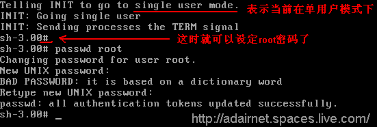 
这时会发现一个问题任何人到主机前都可以通过这种方式修改ROOT密码是很不安全的。
6、为GRUB进入单用户模式设定密码及加密方法：
在GRUB的设定档中设定密码，以防止非法者以单用户模式进入。
（1）编辑grub.conf配置文件，在基本设定的部分里，插入一行 **password 123456** 来设定密码，这里是将密码设定为 123456 。
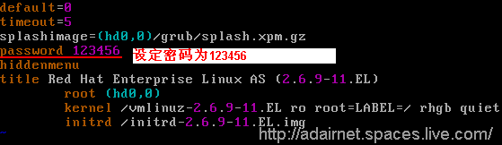 
（2）当重新开机后，在GRUB的菜单中，需要输入 P ,再输入密码才可以进行下一步，选择其它的模式。
 
（3）可以发现上面设定的密码是明文的，在GRUB中是可以对这个密码进行加密的，如下图：
 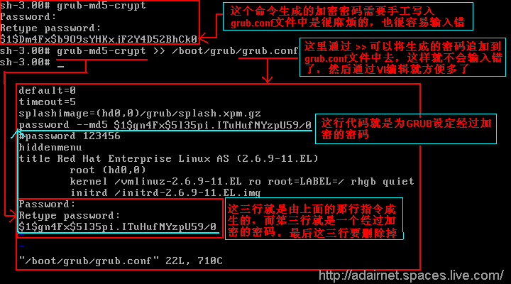 
**注：**grub-md5-crypt这个指令在设定一个加密的密码的时候，就算每次输入的密码相同经加密后也是不同的，所以上面的几组密码都不一样，**grub-md5-crypt >> /boot/grub/grub.conf**  这行指令在执行后不会你上面那样会提示出输入两次密码，虽然没有提示但还是可以输入的，每输入一次密码按一次回车，等设定好密码后，再打开grub.conf文件时，就会发现经过加密的密码就追加到了grub.conf文件中去了，将追加文件中的前二行去掉，第三行就是要使用的密码了，然后就像上图中那样进行设定，等上面的设定好后，一定要删除掉最后三行的内容，不然会出错的。
**password –-md5 这里面的md5 表示后 面使用的密码是经过md5加密的。** 
7、在进入系统前，按E键进入命令编辑模式，来修改引导配置文件
在GRUB菜单选择时，按"e"键，就可以看到所对应系统的三行grub.conf中的配置参数，选择有错误的一行，再按"e"键，可修改这一行：

如下图：选择了第二行，按E键，就可以修改这行内容了，这里只是未了举例子，将正常启动的一行改为了要使用单用户模式启动，修改完成后按回车，返回上一界面，再按"b"键，使用编辑后的设定开机。
 

## 五、介绍Kernel初始化时所做的工作

Kernel在开机时，有以下四项工作：
1、检测电脑上的硬件设备；
2、将检测到的硬件驱动程序载入Kernel；
3、如果必要的驱动载入后 Kernel 将根目录以只读方式挂载进来；
4、Kernel载入第一个程序 init 这个程序；

## 六、介绍 init 这个程序在初始化时做了哪些工作

init 程序读取的是 /etc/inittab 这个配置文件来决定要做哪些操作
1、决定预设要使用哪个 Run Level  下面介绍几个常用的(Run Level 将在下节做详细介绍)
   Run Level 可以从 0 到 6 分为7种
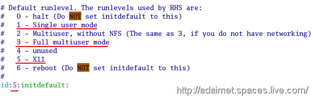 
· run level 1 ：单用户模式，主要用来维护系统，这在前面已经使用过了；
· run level 3 ：会启用完整的服务但登录后进入文字模式；
· run level 5 ：启用完整的服务登录后进入图形界面模式；
**注：**在 inittab 的配置文件里 **id:5:initdefault:**  这项 initdefault 的前面设定为5 表示预设会用 run level 5，也就是默认启用完整服务并进入图形界面模式。
2、init 会执行初始作业系统的程序
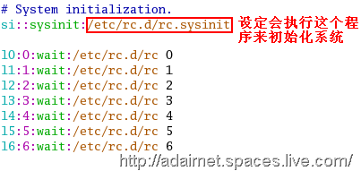 
3、init会根据执行的
 run level 来执行 run level 对应目录里面的程序，如果 inittab 配置文件里预设的 run level 
是5，那么就会把5的参数传给 /etc/rc.d/rc 这个程序执行，在/etc/rc.d目录下就可以看到 rc0.d 至 rc6.d 七个目录
 run level 所对应的目录，所以init 程序会根据执行的 run level 来执行 run level 
对应目录里面的程序，来决定要启用哪些服务。
 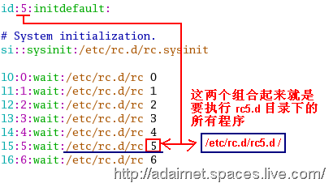 
4、设某个组合键，如下图：定义快捷键，按这三个组合键3秒后重启系统
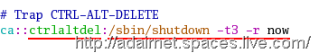 
6、在定义UPS不断电系统，当电源发生问题时，以及电源恢复时都要执行哪些程序。
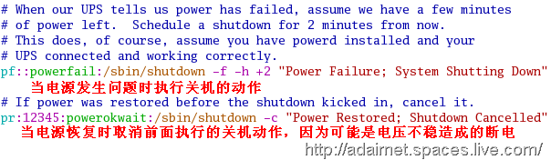 
6、产生六个 virtual consoles （虚拟控制台）(tty1~tty6)
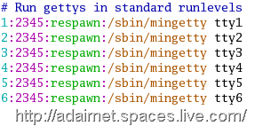 
7、如果启动的是 run level 5 ，初始化工作就会启动 X11(图形界面)
 
## 七、iniit初始化流程图

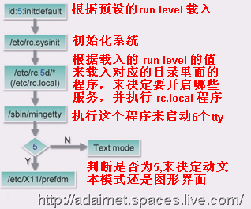 
以下小节将依据上面的流程图为准逐一介绍

## 八、介绍 Run Level （init初始化流程第一步）

其中在 Run Level 里除了0~6这七种外，还有 S 和 emergency 这两种

| **Run Level**     | **功能**                                                     |
| ----------------- | ------------------------------------------------------------ |
| **0**             | 用来做关机用的（不可以设在initdefault里）                    |
| **1,S,emergency** | 单用户模式（只允许root帐号登录，主要是用来做维护系统工作）   |
| **2**             | 可以允许所有使用者登录，但不启用网络功能                     |
| **3**             | 允许所有使用者登录，拥有完整的功能，但是以文字模式进入系统   |
| **4**             | 用户可自定义的，预设下与Run level 3是相同的                  |
| **5**             | 与 Run level 3 功能是一样的，允许所有使用者登录，拥有完整功能，以图形界面模式进入系统 |
| **6**             | 用于重启主机（不可以设在initdefault里）                      |

 

 

 

 

 

 

 

 

Run Level 1,S,emergency 这三种执行时的主要差别在于执行程序的多少：
· 1 ：执行init程序后，会接着执行/etc/rc.sysinit程序来初始化系统，再执行 /etc/rc1.d/目录下的所有程序；
· S：执行init程序后，只会执行/etc/rc.sysinit 程序来初始化系统；
· emergency：执行init程序后，只会执行 /etc/rc.sysinit  程序中某些必要的程序，并不会全部执行；
1、介绍一些Run level 的特性
Run level 是使用 init 这个指令来定义要使用哪个 run level。
2、下面有三种方式可以选择要使用哪个 Run level
(1)在开机时，预设 run level会设定在 /etc/inittab 这个文件中，例如：initdefault 前面的值；
(2)可以从 boot loader 传一个参数给 kernel （例如：在GRUB的引导菜单按“a”键，在开机前可以给kernel传一个参数以单用户模式登录系统）
(3)在开机进入 Linux 系统后，可以使用 init 指令，再输入要进入哪个run level ；（例如：init 5 进入run level 5）
3、使用 runlevel 指令执行后，就可以在下面显示当前在哪个级别下；
    **/sbin/runlevel**

## 九、介绍 /etc/rc.d/rc.sysinit 这个程序主要做哪些工作（init初始化流程第二步）

rc.sysinit 这个文件是一个脚本文件，主要是一些判断程序，还有一些设定变数的程式；

rc.sysinit 这个文件的工作如下：
1、启动 udev ，也就是启用热插拔的设备，例如：USB，并且也会启动SELinux；
2、会把kernel的参数设定在/etc/sysctl.conf配置文件里；这个配置文件下下单元详细说明；
3、设定系统时间；
4、载入 keymaps 设定，keymap设定是在定义键盘，这样电脑开机时才能找到相对应的键盘设定；
5、启用swap这个虚拟内存的分区；
6、设定主机名称，主机名称设定在 /etc/sysconfig/network 配置文件中的 HOSTNAME= 项下；
7、 检查根目录有没有问题，并且重新挂载成为可读可写的状态；
8、启用RAID磁盘阵列，以及LVM的设备；
9、启用磁盘配额的功能，就是限制使用者最多可以使用多少硬盘空间；
10、检查其它的文件系统，并且把它们挂载进来；
11、最后会清除被修改过的locks及PID files，其实就是清除一些开机时的缓存文件，以及一些没有用的信息及文件；

## 十、介绍 /etc/rc.d/rc 这个程式的作用

1、这个步骤就是根据载入的 Run Level

 来执行 Run Level 对应目当里面的程序来决定要启用哪些服务，例如，如果 Run level 的值是5，就会去执行 
/etc/rc.d/rc5.d/* 这个目录下的所有程序，来停用或启动这个运行级别下应该有的服务，如下图：
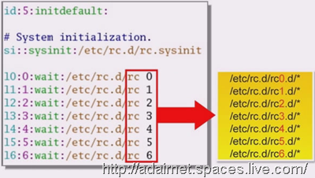 
就用**rc5.d**这个目录来作说明，可以看到这个目录下都是一些链接文件，所有的链接文件都链接到了 **../init.d/\*** 这个目录下的某个执行文件，其实**init.d**和**rc5.d**后面的**d**是代表 **Daemon(**【unix】新进程；端口监督[控]程序**)** 的意思。

## 十一、介绍 Daemon Processes  (**Process进程**)

1、Daemon

 Processes就是在后台执行的程序，主要功能就是在提供一些系统的服务，所以在 init.d 
目录里的所有程序全部都是在后台执行提供系统服务的程序，而这些在后台执行提供系统服务的程序都是在等待别人提出需求来提供服务，例如：httpd 
这个程序就是提供 web 的服务，主要是会开启80端口，让别人可以通过80端口连接进来。
2、Daemon 主要分为两种类型，主要差别在于提供服务的方式，说明如下：
(1)**Standalone**(中文翻译为：独立)：在Standalone的程序里，当使用者提出需求要求服务时，会自己提供服务组使用者；
(2)**Transient**(中文翻译为：暂时程序，暂存区)：当使用者提出需求时，会先跟**xinetd（以称为：Supper Daemon）**这个Daemon程序要求服务，然后xinetd程序再去呼叫 Transient 类型的程序，最后 Transient 类型的程序才能够提供服务给使用者；
3、在**Standalone**的**Daemon**里分为两种：
(1)在开机时，就由 **init** 这个程序直接启动的；
例如：Virtual Console；
(2)**System V Daemon**程式
例如：httpd程序（提供web服务的）；

## 十二、介绍 System V 程式的特性

1、其实 Run Level 是在定义电脑启动时，要提供哪些服务：

**·** 在每个runlevel 里都有他相对应的目录；就像前面提到的 rc5.d 的目录；
**·** 而用来初始化System V的程序都存放在 /etc/rc.d/init.d/ 这个目录里；
2、介绍 runlevel 是如何定义要提供哪些服务的。
因为在runlevel对应的目录里，都有一些连接，而这些链接就是用来呼叫**init.d**目录里的程序的，并夹代一个启动或停止服务的参数，所以根据 runlevel 对应目录里的链接，就可以设定系统在启动后要提供哪些服务。
3、下面介绍前面提到的那个链接文件名称的格式：
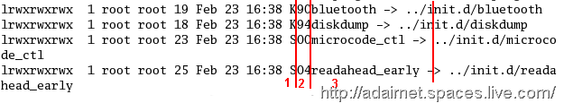 
这个链接文件的名称主要分为三区：
(1) 以**K**或**S**开头：**K** ( Kill 的缩写)开头，表示要停用链接的这个服务；**S** (start 的缩写)开头，表示要启用链接的这个服务；
(2)
 为两位的数字：表示执行的先后顺序，数字越小的越先执行，但是在 K 与 S 执行的先后顺序是先执行 K 停用链接的服务，再执行 S 
启用链接的服务，这是因为要先将所有服务停用类似归零的意思，然后再启用服务，所以执行完这些链接的程序，就初始化了系统上的服务；
(3) 链接的System V 程序名称：
4、另外，System V 程序有种特性，就是启动和停止都用同一个程序，只是后面加上不同的参数：
例：/etc/init.d/httpd start   启用web服务 
     /etc/init.d/httpd stop    停用web服务
这里的 start , stop 就是使用的参数

## 十三、介绍 /etc/rc.d/rc.local 这个程式的作用（init初始化流程第三步）

1、在执行完 run level 下相对应的那个目录里的链接后都会执行 rc.local 这个程式；如下图： run level2到5下都有这个程式：

其中 S 表示启用，99表示执行的顺序最后才会执行，执行的程式就是 rc.local；
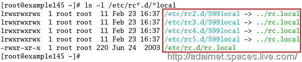 
2、因此，可以修改 rc.local 这个文件，将 runlevel2-5都要执行的指令或程序设定在rc.local文件中。

## 十四、介绍 Virtual Consoles 的特性（init初始化流程第四步)

Virtual consoles，Virtual consoles具有以下几点特性：
1、定义在 /etc/inittab 档案里，使用/sbin/mingetty 来产生 tty1 到 tty6 这六个Virtual consoles；
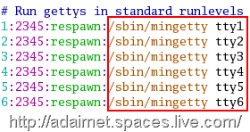  
2、如果要切换 Virtual consoles ，同时按下 ctrl-alt-F(1~6)
3、Virtual consoles的档案是在 /dev/这个目录中，对应的文件是 tty1、tty2、tty3、tty4、tty5、tty6；但这个目录下有许多以tty开头的文件
4、/dev/tty0 是代表当前使用的Virtual consoles
5、在RHEL中有以下三个预设的Virtual consoles设定：
· RHEL中共定义了12个Virtual consoles；
· 在这12个Virtual consoles里，只有1~6的可以登录
· 如果使用图形界面登录，刚会先使用Virtual consoles 7 登录（也就是tty7）
注：当图形界面已启动时，才可以使用 ctrl-alt-F7 才能切换回到图形界面。

## 十五、如何控制系统上服务的停止与启动
在控制系统的服务停止与启动里，主要分为两种类型的工具
1、控制系统预设是会自动启动的服务；
有以下三种工具可以控制 Linux 作业系统，预设会自动启动的服务：
（1）**ntsysv**：这个工具在Virtual
consoles下也可以使用，此命令执行后出现的界面，如下图：可以启动Services界面来设定系统预设要启动哪些服务，如果在ntsysv后面未加参数，只会设定目前这个Run
 level ，如果要设定其它的 run level ，需要在后面加参数：
例如： **ntsysv –level 35**   指定要修改 runlevel 3和5预设要启动的服务
注：这个指令在文字模式下也是可以使用的。
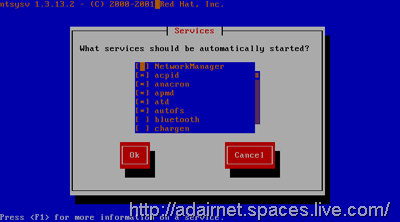 
（2）**chkconfig**：这个工具可以快速设定，并且适用在各种Linux下的命令行模式工具
例如：如下图：查看预设自动启动的设定  注：下面的 gpm 的服务是在 Virtual consoles下可以使用鼠标的服务，通过下图可以看到gpm 服务在runlevel2~5下都以以S开头，也是是预设会自动启动的意思；
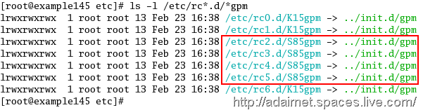 
执行下面的指令，可以让runlevel1~3预设不自动启动gpm的服务，如下图可以看到原来的2和3原来是以S开头的现在已经变成了以K开头，表示预设是停有的。
 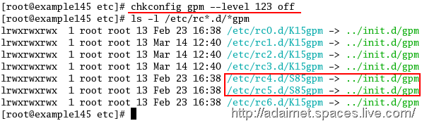 
可以使用chkconfig –list 查看某个服务预设是否会自动启动，如下图：off 表示不启用，on表示启用，如果想查看所有的服务可以将gpm去掉，这时会看到许多服务的列表，
 
（3）**system-config-services**这个工具是图形界面的工具，只能在图形界面下执行，开启视窗后，左边窗口可以勾选预设要启动的服务；点选 Edit Runlevel 可以选择要修改哪个级别的预设服务，但只能设定3~5的，如下图：
 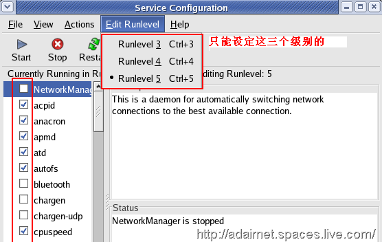 
2、在系统开机后，可以手动控制服务的停止与启动，立即控制服务的启动状态；
有以下三个工具可以手动控制服务的启动与停止：
（1）**service** ：这个工具可以立即启动或停用standalone类型的服务；

在文字模式下如果启用了鼠标功能，使用鼠标选中文字点后，按鼠标的中键就可以将选中的文字粘贴到光标所在处，这样很方便选中一些文字，现在来停用 gpm 这个服务，指令如下：
· service gpm stop      停用gpm服务 （这种方法不一定支持所有的Linux版本）
· /etc/init.d/gpm stop  立即停用gpm服务 （推荐使用绝对路径的方法来执行这个指令：这种方法支持所有Linux版本）
· /etc/init.d/gpm start  立即开启gpm服务
· /etc/init.d/gpm reload 立即重启服务
· /etc/init.d/gpm restart 立即重启服务
· /etc/init.d/gpm status 显示服务启用状态
（2）**chkconfig**：这个工具可以立即启动或停用xinetd程式所管理的服务 
例如：chkconfig telnet off   停用telnet服务；
        chkconfig telnet on   启用telnet服务；
（3）**system-config-services**图形界面工具，选择服务，再点 start（启用） 或 stop（停止） 或 restart（重启）。

## 十六、介绍使用指令关机

有四个指令可以用来关机

1、shutdown –h now     h是halt（终止的意思），**now** 是参数表示立即，也可输入时间例如：**13:22** 表示下午1点22分关机
2、halt 
3、power off
4、init 0  进入runlevel 0级做关机动作；
注：这四个指令在关机前都会执行 sync 这个指令，进行资料的同步，将内存中的数据写入硬盘中，以免将记忆体中的资料丢失。

## 十七、介绍使用指令重启电脑
1、shutdown –r now     -r 就是reboot（重新启动）的意思，这里的now也可以换成时间
2、reboot
3、init 6
6、ctrl-alt-del （在virtual Console环境中使用）