# 1.1 云 API 签名方法

## 准备过程

> 任务时间：时间未知

### 整体说明

本实验，将会通过 Python 语言，以云服务器 > 查询地域列表为例，进行签名，鉴权的简单实现，同时进行测试，最终获得到预期结果。请在操作本实验之前，自己提前获取好密钥信息，并且替换掉本文中的测试密钥。

### 必备环境和工具

请确保已经安装了 Python 等。可以通过：

```
python3 --version
```

或者：

```
python --version
```

来看一下 python 的版本。

### 准备密钥

通过网页：<https://console.cloud.tencent.com/capi>获得秘钥信息（SecretId和SecretKey）例如我的：

SecretId：

```
AKIDGRSHz3e17HVaVEeEWddR4Wr1zmNld5yk
```

SecretKey：

```
rY5VmsobGoBM2YsFWcXG0c3HMI2f6OVU
```

SecretId 用于标识 API 调用者身份 SecretKey 用于加密签名字符串和服务器端验证签名字符串的密钥。 用户必须严格保管安全凭证，避免泄露。API 密钥是构建腾讯云 API 请求的重要凭证，使用腾讯云 API 可以操作您名下的所有腾讯云资源，为了您的财产和服务安全，请妥善保存和定期更换密钥，当您更换密钥后，请及时删除旧密钥。

## 签名理论实现

> 任务时间：时间未知

### 获得参数信息

- 以云服务器 CVM 查询地域列表为例，获取他的参数信息：

| 参数名  | 是否必填 | 参数类型 |
| ------- | -------- | -------- |
| Action  | 是       | String   |
| Version | 是       | String   |
| Region  | 否       | String   |

- 获得公共参数部分：

| 参数名          | 是否必填 | 参数类型 |
| --------------- | -------- | -------- |
| Action          | 是       | String   |
| Region          | 是       | String   |
| Timestamp       | 是       | Integer  |
| Nonce           | 是       | Integer  |
| SecretId        | 是       | String   |
| Signature       | 是       | String   |
| Version         | 是       | String   |
| SignatureMethod | 否       | String   |
| Token           | 否       | String   |

- 删除掉非必须填写参数、重复参数，和目标参数：

| 参数名    | 是否必填 | 参数类型 |
| --------- | -------- | -------- |
| Action    | 是       | String   |
| Version   | 是       | String   |
| Timestamp | 是       | Integer  |
| Nonce     | 是       | Integer  |
| SecretId  | 是       | String   |

### 进行参数排序：

首先对所有请求参数按参数名做字典序升序排列，所谓字典序升序排列，直观上就如同在字典中排列单词一样排序，按照字母表或数字表里递增顺序的排列次序，即先考虑第一个“字母”，在相同的情况下考虑第二个“字母”，依此类推。用户可以借助编程语言中的相关排序函数来实现这一功能，如php中的ksort函数。上述示例参数的排序结果如下:

| 参数名    | 是否必填 | 参数类型 |
| --------- | -------- | -------- |
| Action    | 是       | String   |
| Nonce     | 是       | Integer  |
| SecretId  | 是       | String   |
| Timestamp | 是       | Integer  |
| Version   | 是       | String   |

字典形式：

```
{ 
    'Action' : 'DescribeRegions’, 
    'Nonce' : 11886,
    'SecretId' : 'AKIDGRSHz3e17HVaVEeEWddR4Wr1zmNld5yk',
     'Timestamp' : 1465185768, 
    'Version' : '2017-03-12', 
}
```

### 组成字符串

- 此步骤生成请求字符串。 将把上一步排序好的请求参数格式化成“参数名称”=“参数值”的形式，如对 Action 参数，其参数名称为"Action"，参数值为"DescribeInstances"，因此格式化后就为 Action=DescribeInstances 。 注意：“参数值”为原始值而非url编码后的值。

```
Action=DescribeRegions&
Nonce=11886&
SecretId=AKIDGRSHz3e17HVaVEeEWddR4Wr1zmNld5yk&
Timestamp=1465185768
Version=2017-03-12&
```

- 此步骤生成签名原文字符串。 签名原文字符串由以下几个参数构成:

1) 请求方法: 支持 POST 和 GET 方式，这里使用 GET 请求，注意方法为全大写。 

2) 请求主机:查看实例列表(DescribeInstances)的请求域名为：cvm.tencentcloudapi.com。实际的请求域名根据接口所属模块的不同而不同，详见各接口说明。 

3) 请求路径: 当前版本云 API 的请求路径固定为 / 。 

4) 请求字符串: 即上一步生成的请求字符串。

签名原文串的拼接规则为:

请求方法 + 请求主机 +请求路径 + ? + 请求字符串

```
GETcvm.tencentcloudapi.com/?Action=DescribeRegions&Nonce=11886&SecretId=AKIDGRSHz3e17HVaVEeEWddR4Wr1zmNld5yk&Timestamp=1465185768&Version=2017-03-12
```

### 加密生成签名串

此步骤生成签名串。 首先使用 HMAC-SHA1 算法对上一步中获得的签名原文字符串进行签名，然后将生成的签名串使用 Base64 进行编码，即可获得最终的签名串。

## 签名代码实现

> 任务时间：时间未知

### 建立文件

```python
vim demo_1.py
```

### 输入密钥信息

例如：请注意将密钥信息修改成自己的！

```
SecretId = "AKIDGRSHz3e17HVaVEeEWddR4Wr1zmNld5yk"
SecretKey = "rY5VmsobGoBM2YsFWcXG0c3HMI2f6OVU"
```

### 填写必须信息

```python
import time
uri = "cvm.tencentcloudapi.com"
paramDict = {
    "Action":"DescribeRegions",
    "Version":"2017-03-12",
    "SecretId":SecretId,
    "Nonce":123456,
    "Timestamp":int(time.time()),
}
```

### 排序

```python
tempList = []
tempDict = {}
for eveKey, eveValue in paramDict.items():
    tempLowerData = eveKey.lower()
    tempList.append(tempLowerData)
    tempDict[tempLowerData] = eveKey
tempList.sort()

resultList = []
for eveData in tempList:
    tempStr = str(tempDict[eveData]) + "=" + str(paramDict[tempDict[eveData]])
    resultList.append(tempStr)
```

### 第一次字符串拼接

```python
sourceStr = "&".join(resultList)
```

### 第二次字符串拼接

```python
requestStr = "%s%s%s%s%s"%("GET", uri, "/", "?", sourceStr)
```

### SHA1 加密

```python
import sys
if sys.version_info[0] > 2:
    signStr = requestStr.encode("utf-8")
    SecretKey = SecretKey.encode("utf-8")

import hashlib
digestmod = hashlib.sha1

import hmac
hashed = hmac.new(SecretKey, signStr, digestmod)
```

### Base64编码

```python
import binascii
base64Data = binascii.b2a_base64(hashed.digest())[:-1]

if sys.version_info[0] > 2:
    base64Data = base64Data.decode()
```

### GET请求还需要URL编码

```python
import urllib.parse
base64Data = urllib.parse.quote(base64Data)
```

## 对签名结果测试

> 任务时间：时间未知

### 生成请求url

```python
url = "https://" + uri + "/" + "?" + sourceStr + "&Signature=" + base64Data
```

### 发起请求，并将结果变成Json格式

```python
import urllib.request
import json
for eveData in json.loads(urllib.request.urlopen(url).read().decode("utf-8"))["Response"]["RegionSet"]:
    print(eveData)
```

### 保存上面的文件

- 完整代码如下：

请注意将密钥信息修改成自己的！

```python
## 请将如下的SecretId,SecretKey更换为自己的密钥
SecretId = "AKIDGRSHz3e17HVaVEeEWddR4Wr1zmNld5yk"
SecretKey = "rY5VmsobGoBM2YsFWcXG0c3HMI2f6OVU"

'''
Timestamp Integer 是 当前 UNIX 时间戳，可记录发起 API 请求的时间。例如1529223702，如果与当前时间相差过大，会引起签名过期错误。
Nonce Integer 是 随机正整数，与 Timestamp 联合起来，用于防止重放攻击。
SecretId String 是 在云API密钥上申请的标识身份的 SecretId，一个 SecretId 对应唯一的 SecretKey ，而 SecretKey 会用来生成请求签名 Signature。
Action 是 String 公共参数，本接口取值：DescribeRegions
Version 是 String 公共参数，本接口取值：2017-03-12
'''
import time
uri = "cvm.tencentcloudapi.com"
paramDict = {
    "Action":"DescribeRegions",
    "Version":"2017-03-12",
    "SecretId":SecretId,
    "Nonce":123456,
    "Timestamp":int(time.time()),
}

tempList = []
tempDict = {}
for eveKey, eveValue in paramDict.items():
    tempLowerData = eveKey.lower()
    tempList.append(tempLowerData)
    tempDict[tempLowerData] = eveKey
tempList.sort()

resultList = []
for eveData in tempList:
    tempStr = str(tempDict[eveData]) + "=" + str(paramDict[tempDict[eveData]])
    resultList.append(tempStr)

sourceStr = "&".join(resultList)

requestStr = "%s%s%s%s%s"%("GET", uri, "/", "?", sourceStr)

import sys
if sys.version_info[0] > 2:
    signStr = requestStr.encode("utf-8")
    SecretKey = SecretKey.encode("utf-8")

import hashlib
digestmod = hashlib.sha1

import hmac
hashed = hmac.new(SecretKey, signStr, digestmod)

import binascii
base64Data = binascii.b2a_base64(hashed.digest())[:-1]

if sys.version_info[0] > 2:
    base64Data = base64Data.decode()

import urllib.parse
base64Data = urllib.parse.quote(base64Data)

url = "https://" + uri + "/" + "?" + sourceStr + "&Signature=" + base64Data
print(url)

import urllib.request
import json
for eveData in json.loads(urllib.request.urlopen(url).read().decode("utf-8"))["Response"]["RegionSet"]:
    print(eveData)
```

- 保存文件：

```
:wq
```

- 运行获得结果：

```
python3 demo_1.py
```

- 结果：

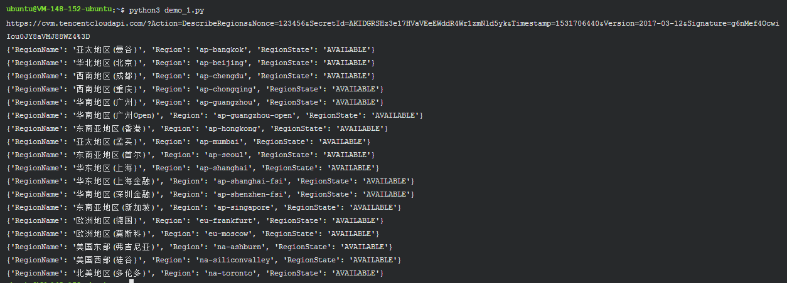

至此，我们完成了签名过程，并进行了相关的验证。


# 1.2 API 的复杂类型与数组类型

## 准备过程

> 任务时间：时间未知

### 整体说明

本实验是衔接上一实验（云 API 签名方法）的，请在上一实验已经理解如何操作之后，在开始本实验，会使用密钥相关信息，请您在实验之前自行准备。

通过网页：<https://console.cloud.tencent.com/capi>

获得秘钥信息（SecretId 和 SecretKey）

由于本教程使用了作者的密钥，所以请您在操作本实验之时替换掉本文中的测试密钥。

### 必备环境和工具

请确保已经安装了 Python 等。可以通过：

```
python3 --version
```

或者：

```
python --version
```

来看一下 python 的版本。

### 准备密钥

通过网页：<https://console.cloud.tencent.com/capi>获得秘钥信息（SecretId 和 SecretKey）例如我的：

SecretId：

```
AKIDGRSHz3e17HVaVEeEWddR4Wr1zmNld5yk
```

SecretKey：

```
rY5VmsobGoBM2YsFWcXG0c3HMI2f6OVU
```

SecretId 用于标识 API 调用者身份 SecretKey 用于加密签名字符串和服务器端验证签名字符串的密钥。 用户必须严格保管安全凭证，避免泄露。

API 密钥是构建腾讯云 API 请求的重要凭证，使用腾讯云 API 可以操作您名下的所有腾讯云资源，为了您的财产和服务安全，请妥善保存和定期更换密钥，当您更换密钥后，请及时删除旧密钥。

## 复杂类型使用方法

> 任务时间：时间未知

### 必备参数准备

- 以云服务器 API > 实例相关接口 > 创建实例询价为例<https://cloud.tencent.com/document/api/213/15726>
- 必备参数

| 参数名    | 是否必填 | 参数类型  |
| --------- | -------- | --------- |
| Action    | 是       | String    |
| Version   | 是       | String    |
| Region    | 是       | String    |
| Placement | 是       | Placement |
| ImageId   | 是       | String    |

这其中 Placement 是复杂参数：

- <https://cloud.tencent.com/document/api/213/15753#Placement>

| 参数名    | 是否必填 | 参数类型        |
| --------- | -------- | --------------- |
| Zone      | 是       | String          |
| ProjectId | 否       | Integer         |
| HostIds   | 否       | Array of String |

### 编写代码并运行

```
vim demo_2.py
```

将课程：云 API 签名方法 中的 “demo_2.py” 代码复制过来：

```
SecretId = "AKIDGRSHz3e17HVaVEeEWddR4Wr1zmNld5yk"
SecretKey = "rY5VmsobGoBM2YsFWcXG0c3HMI2f6OVU"

import time
uri = "cvm.tencentcloudapi.com"
paramDict = {
    "Action":"DescribeRegions",
    "Version":"2017-03-12",
    "SecretId":SecretId,
    "Nonce":123456,
    "Timestamp":int(time.time()),
}

tempList = []
tempDict = {}
for eveKey, eveValue in paramDict.items():
    tempLowerData = eveKey.lower()
    tempList.append(tempLowerData)
    tempDict[tempLowerData] = eveKey
tempList.sort()

resultList = []
for eveData in tempList:
    tempStr = str(tempDict[eveData]) + "=" + str(paramDict[tempDict[eveData]])
    resultList.append(tempStr)

sourceStr = "&".join(resultList)

requestStr = "%s%s%s%s%s"%("GET", uri, "/", "?", sourceStr)

import sys
if sys.version_info[0] > 2:
    signStr = requestStr.encode("utf-8")
    SecretKey = SecretKey.encode("utf-8")

import hashlib
digestmod = hashlib.sha1

import hmac
hashed = hmac.new(SecretKey, signStr, digestmod)

import binascii
base64Data = binascii.b2a_base64(hashed.digest())[:-1]

if sys.version_info[0] > 2:
    base64Data = base64Data.decode()

import urllib.parse
base64Data = urllib.parse.quote(base64Data)

url = "https://" + uri + "/" + "?" + sourceStr + "&Signature=" + base64Data
print(url)

import urllib.request
import json
for eveData in json.loads(urllib.request.urlopen(url).read().decode("utf-8"))["Response"]["RegionSet"]:
    print(eveData)
```

对其中部分内容进行修改：

- 修改1：

```
paramDict = {
    "Action":"DescribeRegions",
    "Version":"2017-03-12",
    "SecretId":SecretId,
    "Nonce":123456,
    "Timestamp":int(time.time()),
}
```

改为：

```
paramDict = {
    "Action":"InquiryPriceRunInstances",
    "Version":"2017-03-12",
    "SecretId":SecretId,
    "Nonce":123456,
    "Timestamp":int(time.time()),
    "Region":"ap-beijing",
    "ImageId":"img-8toqc6s3",
    "Placement.Zone":"ap-beijing-1",
}
```

- 修改2：

```
for eveData in json.loads(urllib.request.urlopen(url).read().decode("utf-8"))["Response"]["RegionSet"]:
    print(eveData)
```

改为：

```
print(json.loads(urllib.request.urlopen(url).read().decode("utf-8")))
```

- 完整代码如下：

```
SecretId = "AKIDGRSHz3e17HVaVEeEWddR4Wr1zmNld5yk"
SecretKey = "rY5VmsobGoBM2YsFWcXG0c3HMI2f6OVU"

import time
uri = "cvm.tencentcloudapi.com"
paramDict = {
    "Action":"InquiryPriceRunInstances",
    "Version":"2017-03-12",
    "SecretId":SecretId,
    "Nonce":123456,
    "Timestamp":int(time.time()),
    "Region":"ap-beijing",
    "ImageId":"img-8toqc6s3",
    "Placement.Zone":"ap-beijing-1",
}
tempList = []
tempDict = {}
for eveKey, eveValue in paramDict.items():
    tempLowerData = eveKey.lower()
    tempList.append(tempLowerData)
    tempDict[tempLowerData] = eveKey
tempList.sort()

resultList = []
for eveData in tempList:
    tempStr = str(tempDict[eveData]) + "=" + str(paramDict[tempDict[eveData]])
    resultList.append(tempStr)

sourceStr = "&".join(resultList)

requestStr = "%s%s%s%s%s"%("GET", uri, "/", "?", sourceStr)

import sys
if sys.version_info[0] > 2:
    signStr = requestStr.encode("utf-8")
    SecretKey = SecretKey.encode("utf-8")

import hashlib
digestmod = hashlib.sha1

import hmac
hashed = hmac.new(SecretKey, signStr, digestmod)

import binascii
base64Data = binascii.b2a_base64(hashed.digest())[:-1]

if sys.version_info[0] > 2:
    base64Data = base64Data.decode()

import urllib.parse
base64Data = urllib.parse.quote(base64Data)

url = "https://" + uri + "/" + "?" + sourceStr + "&Signature=" + base64Data
print(url)

import urllib.request
import json
print(json.loads(urllib.request.urlopen(url).read().decode("utf-8")))
```

- 保存文件：

```
:wq
```

- 运行获得结果：

```
python3 demo_2.py
```

- 结果：

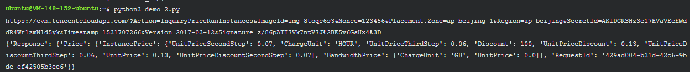

- 总结：复杂类型的使用方法，实际上就是通过 参数名.key = value 的形式来实现。

## 数组类型使用方法

> 任务时间：时间未知

### 必备参数准备

以云服务器 API > 镜像相关接口 > 查看镜像列表为例<https://cloud.tencent.com/document/api/213/15715>

实验参数

| 参数名     | 是否必填 | 参数类型        |
| ---------- | -------- | --------------- |
| Action     | 是       | String          |
| Version    | 是       | String          |
| Region     | 是       | String          |
| ImageIds.N | 否       | Array of String |

### 编写代码并运行

```
vim demo_3.py
```

将课程：云 API 签名方法 中的 “demo_2.py” 代码复制过来：

```
SecretId = "AKIDGRSHz3e17HVaVEeEWddR4Wr1zmNld5yk"
SecretKey = "rY5VmsobGoBM2YsFWcXG0c3HMI2f6OVU"


import time
uri = "cvm.tencentcloudapi.com"
paramDict = {
    "Action":"DescribeRegions",
    "Version":"2017-03-12",
    "SecretId":SecretId,
    "Nonce":123456,
    "Timestamp":int(time.time()),
}

tempList = []
tempDict = {}
for eveKey, eveValue in paramDict.items():
    tempLowerData = eveKey.lower()
    tempList.append(tempLowerData)
    tempDict[tempLowerData] = eveKey
tempList.sort()

resultList = []
for eveData in tempList:
    tempStr = str(tempDict[eveData]) + "=" + str(paramDict[tempDict[eveData]])
    resultList.append(tempStr)

sourceStr = "&".join(resultList)

requestStr = "%s%s%s%s%s"%("GET", uri, "/", "?", sourceStr)

import sys
if sys.version_info[0] > 2:
    signStr = requestStr.encode("utf-8")
    SecretKey = SecretKey.encode("utf-8")

import hashlib
digestmod = hashlib.sha1

import hmac
hashed = hmac.new(SecretKey, signStr, digestmod)

import binascii
base64Data = binascii.b2a_base64(hashed.digest())[:-1]

if sys.version_info[0] > 2:
    base64Data = base64Data.decode()

import urllib.parse
base64Data = urllib.parse.quote(base64Data)

url = "https://" + uri + "/" + "?" + sourceStr + "&Signature=" + base64Data
print(url)

import urllib.request
import json
for eveData in json.loads(urllib.request.urlopen(url).read().decode("utf-8"))["Response"]["RegionSet"]:
    print(eveData)
```

对其中部分内容进行修改：

- 修改1：

```
paramDict = {
    "Action":"DescribeRegions",
    "Version":"2017-03-12",
    "SecretId":SecretId,
    "Nonce":123456,
    "Timestamp":int(time.time()),
}
```

改为：

```
paramDict = {
    "Action":"DescribeImages",
    "Version":"2017-03-12",
    "SecretId":SecretId,
    "Nonce":123456,
    "Timestamp":int(time.time()),
    "Region":"ap-beijing",
    "ImageIds.0":"img-8toqc6s3",
    "ImageIds.0":"img-gvbnzy6f",
}
```

- 修改2：

```
for eveData in json.loads(urllib.request.urlopen(url).read().decode("utf-8"))["Response"]["RegionSet"]:
    print(eveData)
```

改为：

```
print(json.loads(urllib.request.urlopen(url).read().decode("utf-8")))
```

- 完整代码如下：

```
SecretId = "AKIDGRSHz3e17HVaVEeEWddR4Wr1zmNld5yk"
SecretKey = "rY5VmsobGoBM2YsFWcXG0c3HMI2f6OVU"

import time
uri = "cvm.tencentcloudapi.com"
paramDict = {
    "Action":"DescribeImages",
    "Version":"2017-03-12",
    "SecretId":SecretId,
    "Nonce":123456,
    "Timestamp":int(time.time()),
    "Region":"ap-beijing",
    "ImageIds.0":"img-8toqc6s3",
    "ImageIds.0":"img-gvbnzy6f",
}
tempList = []
tempDict = {}
for eveKey, eveValue in paramDict.items():
    tempLowerData = eveKey.lower()
    tempList.append(tempLowerData)
    tempDict[tempLowerData] = eveKey
tempList.sort()

resultList = []
for eveData in tempList:
    tempStr = str(tempDict[eveData]) + "=" + str(paramDict[tempDict[eveData]])
    resultList.append(tempStr)

sourceStr = "&".join(resultList)

requestStr = "%s%s%s%s%s"%("GET", uri, "/", "?", sourceStr)

import sys
if sys.version_info[0] > 2:
    signStr = requestStr.encode("utf-8")
    SecretKey = SecretKey.encode("utf-8")

import hashlib
digestmod = hashlib.sha1

import hmac
hashed = hmac.new(SecretKey, signStr, digestmod)

import binascii
base64Data = binascii.b2a_base64(hashed.digest())[:-1]

if sys.version_info[0] > 2:
    base64Data = base64Data.decode()

import urllib.parse
base64Data = urllib.parse.quote(base64Data)

url = "https://" + uri + "/" + "?" + sourceStr + "&Signature=" + base64Data
print(url)

import urllib.request
import json
print(json.loads(urllib.request.urlopen(url).read().decode("utf-8")))
```

- 保存文件：

```
:wq
```

- 运行获得结果：

```
python3 demo_3.py
```

- 结果：

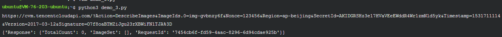

- 总结：数组类型的使用方法，实际上就是通过 参数名.index = value 的形式来实现。

## 复杂类型与数组类型混合使用

> 任务时间：时间未知

### 必备参数准备

- null以云服务器 API > 实例相关接口 > 查询实例机型列表<https://cloud.tencent.com/document/api/213/15749>
- null实验参数

| 参数名    | 是否必填 | 参数类型        |
| --------- | -------- | --------------- |
| Action    | 是       | String          |
| Version   | 是       | String          |
| Region    | 是       | String          |
| Filters.N | 否       | Array of Filter |

这其中 Filters 是复杂参数：

- <https://cloud.tencent.com/document/api/213/15753#Filter>

| 参数名 | 是否必填 | 参数类型        |
| ------ | -------- | --------------- |
| Name   | 是       | String          |
| Values | 否       | Array of String |

### 编写代码并运行

```
vim demo_4.py
```

将课程：云 API 签名方法 中的 “demo_2.py” 代码复制过来：

```
SecretId = "AKIDGRSHz3e17HVaVEeEWddR4Wr1zmNld5yk"
SecretKey = "rY5VmsobGoBM2YsFWcXG0c3HMI2f6OVU"

import time
uri = "cvm.tencentcloudapi.com"
paramDict = {
    "Action":"DescribeRegions",
    "Version":"2017-03-12",
    "SecretId":SecretId,
    "Nonce":123456,
    "Timestamp":int(time.time()),
}

tempList = []
tempDict = {}
for eveKey, eveValue in paramDict.items():
    tempLowerData = eveKey.lower()
    tempList.append(tempLowerData)
    tempDict[tempLowerData] = eveKey
tempList.sort()

resultList = []
for eveData in tempList:
    tempStr = str(tempDict[eveData]) + "=" + str(paramDict[tempDict[eveData]])
    resultList.append(tempStr)

sourceStr = "&".join(resultList)

requestStr = "%s%s%s%s%s"%("GET", uri, "/", "?", sourceStr)

import sys
if sys.version_info[0] > 2:
    signStr = requestStr.encode("utf-8")
    SecretKey = SecretKey.encode("utf-8")

import hashlib
digestmod = hashlib.sha1

import hmac
hashed = hmac.new(SecretKey, signStr, digestmod)

import binascii
base64Data = binascii.b2a_base64(hashed.digest())[:-1]

if sys.version_info[0] > 2:
    base64Data = base64Data.decode()

import urllib.parse
base64Data = urllib.parse.quote(base64Data)

url = "https://" + uri + "/" + "?" + sourceStr + "&Signature=" + base64Data
print(url)

import urllib.request
import json
for eveData in json.loads(urllib.request.urlopen(url).read().decode("utf-8"))["Response"]["RegionSet"]:
    print(eveData)
```

对其中部分内容进行修改：

- 修改1：

```
paramDict = {
    "Action":"DescribeRegions",
    "Version":"2017-03-12",
    "SecretId":SecretId,
    "Nonce":123456,
    "Timestamp":int(time.time()),
}
```

改为：

```
paramDict = {
    "Action":"DescribeInstanceTypeConfigs",
    "Version":"2017-03-12",
    "SecretId":SecretId,
    "Nonce":123456,
    "Timestamp":int(time.time()),
    "Region":"ap-beijing",
    "Filters.0.Name":"zone",
    "Filters.0.Values.0":"ap-beijing1-1",
    "Filters.1.Name":"instance-family",
    "Filters.1.Values.0":"S1",
}
```

- 修改2：

```
for eveData in json.loads(urllib.request.urlopen(url).read().decode("utf-8"))["Response"]["RegionSet"]:
    print(eveData)
```

改为：

```
print(json.loads(urllib.request.urlopen(url).read().decode("utf-8")))
```

- 完整代码如下：

```
SecretId = "AKIDGRSHz3e17HVaVEeEWddR4Wr1zmNld5yk"
SecretKey = "rY5VmsobGoBM2YsFWcXG0c3HMI2f6OVU"

import time
uri = "cvm.tencentcloudapi.com"
paramDict = {
    "Action":"DescribeInstanceTypeConfigs",
    "Version":"2017-03-12",
    "SecretId":SecretId,
    "Nonce":123456,
    "Timestamp":int(time.time()),
    "Region":"ap-beijing",
    "Filters.0.Name":"zone",
    "Filters.0.Values.0":"ap-beijing1-1",
    "Filters.1.Name":"instance-family",
    "Filters.1.Values.0":"S1",
}
tempList = []
tempDict = {}
for eveKey, eveValue in paramDict.items():
    tempLowerData = eveKey.lower()
    tempList.append(tempLowerData)
    tempDict[tempLowerData] = eveKey
tempList.sort()

resultList = []
for eveData in tempList:
    tempStr = str(tempDict[eveData]) + "=" + str(paramDict[tempDict[eveData]])
    resultList.append(tempStr)

sourceStr = "&".join(resultList)

requestStr = "%s%s%s%s%s"%("GET", uri, "/", "?", sourceStr)

import sys
if sys.version_info[0] > 2:
    signStr = requestStr.encode("utf-8")
    SecretKey = SecretKey.encode("utf-8")

import hashlib
digestmod = hashlib.sha1

import hmac
hashed = hmac.new(SecretKey, signStr, digestmod)

import binascii
base64Data = binascii.b2a_base64(hashed.digest())[:-1]

if sys.version_info[0] > 2:
    base64Data = base64Data.decode()

import urllib.parse
base64Data = urllib.parse.quote(base64Data)

url = "https://" + uri + "/" + "?" + sourceStr + "&Signature=" + base64Data
print(url)

import urllib.request
import json
print(json.loads(urllib.request.urlopen(url).read().decode("utf-8")))
```

- 保存文件：

```
:wq
```

- 运行获得结果：

```
python3 demo_4.py
```

- 结果：

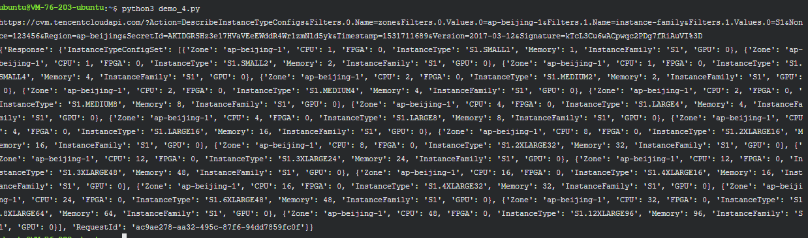

- 总结：复杂类型和数组类型的混合是相对来说比较复杂的情况。但是可以通过类似如下的格式实现：以本实验实例为例：

```
"Filters.0.Name":"zone",
"Filters.0.Values.0":"ap-beijing1-1",
```

# 1.3 SDK 的使用方法

## 准备过程

> 任务时间：时间未知

### 整体说明

本实验，会使用密钥相关信息，请您在实验之前自行准备。

通过网页：<https://console.cloud.tencent.com/capi>

获得秘钥信息（SecretId 和 SecretKey）

请在操作本实验之时替换掉本文中的测试密钥。

### 必备环境和工具

- 请确保已经安装了 Python ：

可以通过：

```
python3 --version
```

或者：

```
python --version
```

来看一下 python 的版本。

- 请确保已经安装了 pip：

可以通过：

```
pip3 --version
```

或者：

```
pip --version
```

来看一下 pip 的版本。

如果没有安装 pip 可以通过 apt-get 安装：

```
sudo apt-get install python3-pip -y
```

### 安装 SDK

```
sudo pip3 install tencentcloud-sdk-python
```

### 准备密钥

通过网页：<https://console.cloud.tencent.com/capi>获得秘钥信息（SecretId 和 SecretKey）例如我的：

SecretId：

```
AKIDGRSHz3e17HVaVEeEWddR4Wr1zmNld5yk
```

SecretKey：

```
rY5VmsobGoBM2YsFWcXG0c3HMI2f6OVU
```

SecretId 用于标识 API 调用者身份 SecretKey 用于加密签名字符串和服务器端验证签名字符串的密钥。 用户必须严格保管安全凭证，避免泄露。

API 密钥是构建腾讯云 API 请求的重要凭证，使用腾讯云 API 可以操作您名下的所有腾讯云资源，为了您的财产和服务安全，请妥善保存和定期更换密钥，当您更换密钥后，请及时删除旧密钥。

## 使用 SDK

> 任务时间：时间未知

### 开始使用

通过页面：

<https://cloud.tencent.com/document/sdk/Python>

可以看到，目前最新版本的 SDK 支持了下列产品

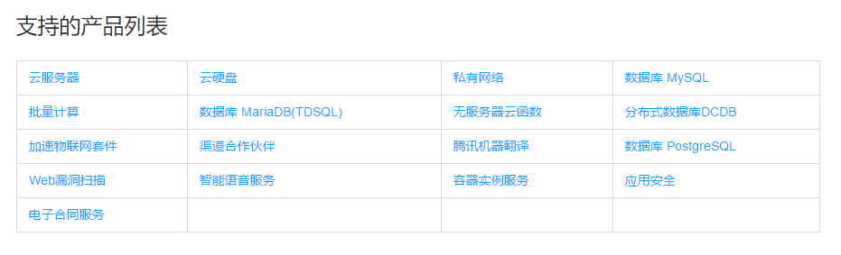

对于新版 SDK 没有支持的产品，大家可以继续使用老版的 SDK，（新版 SDK 直接兼容了老版 SDK）

通过页面安装提示部分，可以看到源码在 Github 上面的托管地址：

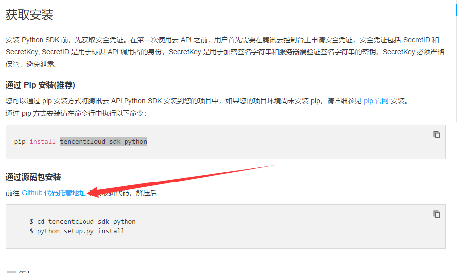

进而，我们可以找到两个实例：

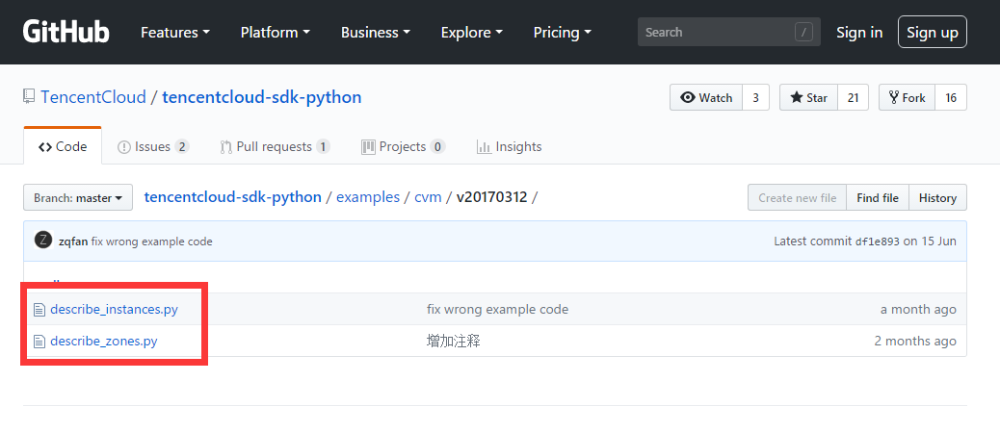

### 实例1：SDK 的简单例子

例子：云服务器 > 查看地域列表

建立 demo 文件：

```
vim demo_1.py
```

复制粘贴代码：

```
# -*- coding: utf-8 -*-

from tencentcloud.common import credential
from tencentcloud.common.exception.tencent_cloud_sdk_exception import TencentCloudSDKException
# 导入对应产品模块的client models。
from tencentcloud.cvm.v20170312 import cvm_client, models
try:
    # 实例化一个认证对象，入参需要传入腾讯云账户secretId，secretKey
    cred = credential.Credential("AKIDGRSHz3e17HVaVEeEWddR4Wr1zmNld5yk", "rY5VmsobGoBM2YsFWcXG0c3HMI2f6OVU")

    # 实例化要请求产品(以cvm为例)的client对象
    client = cvm_client.CvmClient(cred, "ap-shanghai")

    # 实例化一个请求对象
    req = models.DescribeZonesRequest()

    # 通过client对象调用想要访问的接口，需要传入请求对象
    resp = client.DescribeZones(req)
    # 输出json格式的字符串回包
    print(resp.to_json_string())

except TencentCloudSDKException as err:
    print(err)
```

保存并退出：

```
:wq
```

运行代码：

```
python3 demo_1.py
```

运行结果如下：

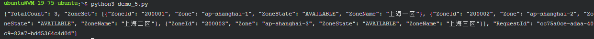

### SDK 的复杂类型与数组类型

例子：云服务器 > 查询实例

建立 demo 文件：

```
vim demo_2.py
```

复制粘贴代码：

```
# -*- coding: utf-8 -*-

from tencentcloud.common import credential
from tencentcloud.common.exception.tencent_cloud_sdk_exception import TencentCloudSDKException
# 导入对应产品模块的client models。
from tencentcloud.cvm.v20170312 import cvm_client, models

try:
    # 实例化一个认证对象，入参需要传入腾讯云账户secretId，secretKey
    cred = credential.Credential("AKIDGRSHz3e17HVaVEeEWddR4Wr1zmNld5yk", "rY5VmsobGoBM2YsFWcXG0c3HMI2f6OVU")

    # 实例化要请求产品(以cvm为例)的client对象，clientProfile是可选的。
    client = cvm_client.CvmClient(cred, "ap-shanghai")

    # 实例化一个cvm实例信息查询请求对象,每个接口都会对应一个request对象。
    req = models.DescribeInstancesRequest()


    # 这里支持以标准json格式的string来赋值请求参数的方式。下面的代码跟上面的参数赋值是等效的。
    params = '''{
        "Filters": [
            {
                "Name": "zone",
                "Values": ["ap-shanghai-1", "ap-shanghai-2"]
            }
        ]
    }'''
    req.from_json_string(params)

    # 通过client对象调用DescribeInstances方法发起请求。注意请求方法名与请求对象是对应的。
    # 返回的resp是一个DescribeInstancesResponse类的实例，与请求对象对应。
    resp = client.DescribeInstances(req)

    # 输出json格式的字符串回包
    print(resp.to_json_string())

    # 也可以取出单个值。
    # 你可以通过官网接口文档或跳转到response对象的定义处查看返回字段的定义。
    print(resp.TotalCount)

except TencentCloudSDKException as err:
    print(err)
```

保存并退出：

```
:wq
```

运行代码：

```
python3 demo_2.py
```

运行结果如下：

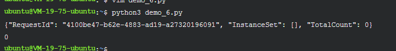

# 1.4 命令行工具的使用方法

## 准备过程

> 任务时间：时间未知

### 整体说明

本实验将以 Python 语言和 tencentcloud-sdk-python 为例。

本实验，会使用密钥相关信息，请您在实验之前自行准备。

通过网页：<https://console.cloud.tencent.com/capi>

获得秘钥信息（SecretId 和 SecretKey）

请在操作本实验之时替换掉本文中的测试密钥。

### 必备环境和工具

- 请确保已经安装了 Python：

可以通过：

```
python3 --version
```

或者：

```
python --version
```

来看一下python的版本。

- 请确保已经安装了 pip ：

可以通过：

```
pip3 --version
```

或者：

```
pip --version
```

来看一下 pip 的版本。

如果没有安装 pip 可以通过 apt-get 安装：

```
sudo apt-get install python3-pip -y
```

### 安装CLI

```
sudo pip3 install tccli
```

### 准备密钥

通过网页：<https://console.cloud.tencent.com/capi>获得秘钥信息（SecretId 和 SecretKey）例如我的：

SecretId：

```
AKIDGRSHz3e17HVaVEeEWddR4Wr1zmNld5yk
```

SecretKey：

```
rY5VmsobGoBM2YsFWcXG0c3HMI2f6OVU
```

SecretId 用于标识 API 调用者身份 SecretKey 用于加密签名字符串和服务器端验证签名字符串的密钥。 用户必须严格保管安全凭证，避免泄露。

API 密钥是构建腾讯云 API 请求的重要凭证，使用腾讯云 API 可以操作您名下的所有腾讯云资源，为了您的财产和服务安全，请妥善保存和定期更换密钥，当您更换密钥后，请及时删除旧密钥。

## 使用 TCCLI

> 任务时间：时间未知

### 配置 TCCLI

可以通过：

```
tccli configure
```

进行 TCCLI 的配置，按照提示依次输入对应的 SecretId，SecretKey 等信息即可：

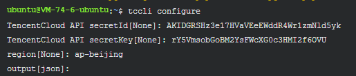

### 简单使用

TCCLI 的基本使用方法，类似这样：

```
tccli 产品名 接口名 --参数
```

以云服务器>查询地域列表为例：

```
tccli cvm DescribeRegions
```

运行结果：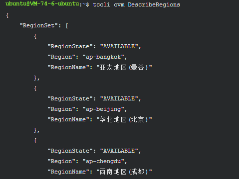

### 复杂类型使用

以云服务器>创建实例询价为例可能输入的参数有（部分）：

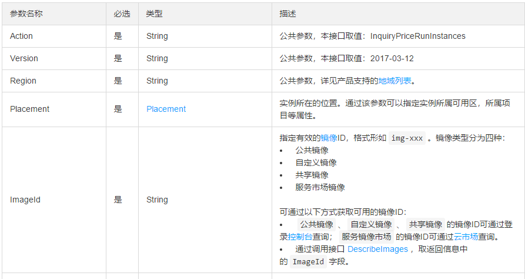

控制台输入代码：

```
tccli cvm InquiryPriceRunInstances --Placement '{"Zone":"ap-beijing-1"}' --ImageId "img-8toqc6s3"
```

运行结果：

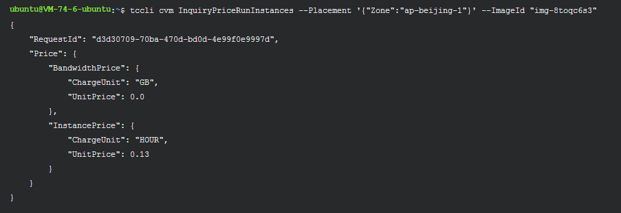

### 数组类型使用

以云服务器>查看镜像列表为例可能输入的参数有（部分）：

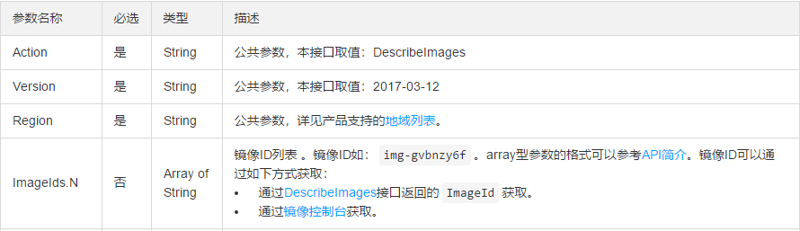

控制台输入代码：

```
 tccli cvm DescribeImages --ImageIds '["img-gvbnzy6f","img-8toqc6s3"]'
```

运行结果：

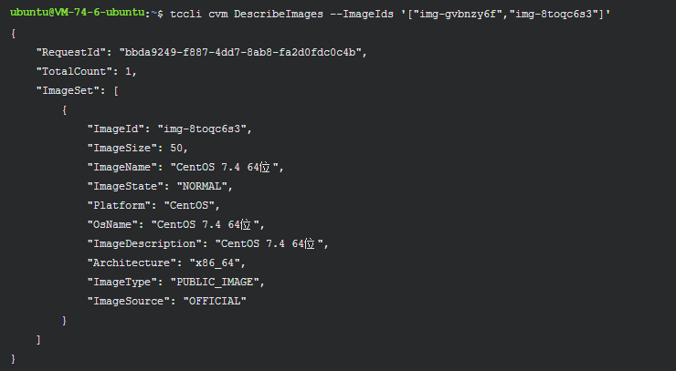

## 特殊说明

> 任务时间：时间未知

### 操作系统差异

在 Windows 和 Linux 系统下，参数输入方法可能会有略微不同。例如：

- 在 Linux 下：

```
 tccli cvm DescribeImages --ImageIds '["img-gvbnzy6f","img-8toqc6s3"]'
```

- 在 Windows 下：

```
 tccli cvm DescribeImages --ImageIds '[\"img-gvbnzy6f\",\"img-8toqc6s3\"]'
```

### 总结

本实验只是简单的举例，说明 TCCLI 的使用方法，更多，更详细的教程请参考[这里](https://cloud.tencent.com/document/product/440/6176).

# 附: 相关链接

- [腾讯云API开发文档](https://cloud.tencent.com/document/api)
- [腾讯云开发者工具套件(SDK)](https://github.com/TencentCloud/tencentcloud-sdk-python)

